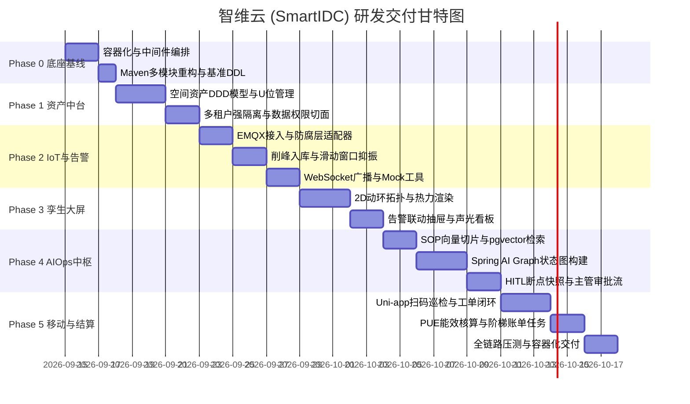

# 《智维云 (SmartIDC)》系统全生命周期开发实施计划

> **项目定位**：企业级绿色数据中心动环监控、资产全生命周期管理与 AIOps 智能运维协同中台。  
> **核心基准**：严格对标 [SDS.md (系统设计规范书)](file:///d:/SmartIDC/SDS.md)。  
> **实施策略**：采用 6 个敏捷阶段（Phase 0 ~ Phase 5）渐进式演进与交付，确保各层解耦、每阶段均有可运行验证的成果。

---

## 总体里程碑路线图

---

## 阶段详解

### 🛠️ Phase 0: 基础设施搭建与工程脚手架重构（预计 2~3 天）

#### 1. 目标
搭建底层工业级中间件环境，确立 Maven 多模块工程架构，跑通前后端基线工程并建立数据库基准。

#### 2. 详细任务分解
- **T0.1 容器化本地基础设施编排 (`docker-compose.yml`)**：
  - **MySQL 8.0**：配置 `utf8mb4` 字符集、开启 binlog、优化 InnoDB 缓冲池。
  - **Redis 7.x**：设置持久化策略（AOF/RDB）与访问密钥，预留分布式锁与热点缓存通道。
  - **EMQX 5.x**：工业级开源 MQTT Broker，配置客户端认证（ACL 预留），开放 `1883` (TCP)、`8083` (WS) 与 `18083` (Dashboard 控制台)。
  - **PostgreSQL 16 + pgvector**：启用 `vector` 向量扩展插件，为 Phase 4 的 SOP 运维手册 RAG 做底层存储支持。
  - **MinIO**：私有对象存储服务，供巡检工单中现场照片与故障视频存证。
- **T0.2 Maven 多模块分层工程初始化 (JDK 21 + Spring Boot 3.3.x)**：
  - `smartidc-common`：核心工具类、通用枚举、统一响应体 `R<T>`、脱敏注解与异常处理器。
  - `smartidc-framework`：Spring Security 鉴权、MyBatis-Plus 配置、租户切面、Redis 缓存与 Redisson 分布式锁配置。
  - `smartidc-iot`：EMQX MQTT/AMQP 客户端接入、TelemetryAdapter 报文防腐层、线程池批处理入库引擎。
  - `smartidc-biz`：机柜空间资产、告警事件、工单状态机、PUE 计费结算等业务领域服务。
  - `smartidc-aiops`：Spring AI Alibaba 集成、Graph 状态图定义、AgentCheckpoint 状态快照、pgvector 向量检索与 MCP 工具链。
  - `smartidc-admin`：应用主启动类、Swagger/Knife4j 文档、WebSocket 接入端点及前端 REST API 控制器。
- **T0.3 数据库 DDL 基线建立与种子数据导入**：
  - 执行 `SDS.md` 中的 6 张核心表结构：
    - `idc_rack`（机架表）
    - `idc_device`（设备与传感器表）
    - `idc_telemetry_snapshot`（按天分区的时序快照表）
    - `idc_alarm_event`（告警事件表）
    - `idc_work_ticket`（智能工单表）
    - `idc_billing_statement`（月度计费结算表）
  - 导入租户种子（`000000` 平台运营租户、`T10001` 示范租户）、机房字典（华东01-A区）、系统管理员与主管角色账号。
- **T0.4 前端 Admin 工程基座初始化**：
  - 基于 Vue3 + Vite + Element-Plus + Pinia 初始化 Admin Web 控制台，联通后端基础登录与租户切换。

#### 3. 验收标准
- `docker compose up -d` 能一键拉起所有 5 个中间件并全部处于健康状态（Healthy）。
- 后端服务成功启动，JDK 21 虚拟线程支持就绪，Swagger 文档页面可正常访问。
- 数据库 6 张核心表建表成功，分区规则正常生效。

---

### 🏢 Phase 1: 空间资产全生命周期与中台基座（预计 4~5 天）

#### 1. 目标
建立 IDC 物理拓扑层级（Room ➔ Cabinet ➔ Slot），管理 IT/动环设备台账与 42U 位图，落地企业级多租户数据强隔离与机房行级数据权限。

#### 2. 详细任务分解
- **T1.1 空间-资产 DDD 领域服务实现**：
  - 空间拓扑建模：机房区域管理（Room）➔ 机架/机柜管理（Cabinet/Rack，额定 42U 与额定供电容量）。
  - 设备台账分类管理：
    - `SENSOR_*`：动环传感器（温湿度传感器、智能电表、UPS 监测仪、水浸传感器）。
    - `IT_*`：机架式服务器、网络核心/接入交换机、PDU。
  - U位占用校验与操作防冲突：上架操作时校验 `[start_u, start_u + u_height - 1]` 范围冲突，更新机柜 `used_u` 统计。
- **T1.2 多租户隔离与机房级行级数据权限切面**：
  - 继承 MyBatis-Plus `TenantLineHandler`，对带有 `tenant_id` 的所有业务表在 SQL 执行时自动注入租户过滤条件。
  - 基于 AOP + JSqlParser 实现 `DataPermissionHandler`：驻场运维仅可查看其被指派的机房数据，机房主管具备全区域机房视图。
- **T1.3 Admin Web 资产管理与 42U 可视化机柜组件**：
  - 研发通用的 `CabinetRackView.vue`（42U 机柜物理插槽视图，支持空闲/占用颜色区分、悬浮展示设备信息、空闲位快速点击上架）。
  - 机房拓扑资产列表与租户机柜分配绑定。

#### 3. 验收标准
- 支持多租户在隔离状态下各自创建机柜与设备，跨租户查询严格阻断。
- 42U 机架插槽重叠冲突时返回语义化业务校验异常。
- 机柜视图能直观呈现已用 U 位、剩余 U 位与设备明细。

---

### ⚡ Phase 2: IoT 动环遥测接入、削峰写入与告警风暴抑制（预计 5~6 天）

#### 1. 目标
打通从 MQTT 设备报文接收、防腐协议转换、Redis 状态缓存、线程池批量削峰落库，到滑动窗口抑振告警与 WebSocket 秒级推屏的全流程。

#### 2. 详细任务分解
- **T2.1 EMQX 客户端与防腐层适配器 (`TelemetryAdapter`)**：
  - Spring Boot 集成 Eclipse Paho / Spring Integration MQTT，订阅主题 `/sys/smartidc/+/rack/+/telemetry`。
  - 防腐层将外部异构 JSON 报文转化为系统标准领域值对象 `TelemetryMetric`（解耦具体传感器厂商协议）。
- **T2.2 高吞吐物联削峰与冷热分离架构**：
  - **热数据直写 Redis**：收到最新遥测数据后，以 `smartidc:telemetry:latest:{rackCode}` 为 Key 写入 Redis Hash，过期时间 5 分钟，专供大屏超高频拉取。
  - **温数据攒批入库**：构建阻塞缓冲队列与 `ThreadPoolTaskExecutor` 定时批量处理器，满 100 条或满 2 秒执行一次批量 `INSERT INTO idc_telemetry_snapshot`，规避数据库 IOPS 击穿。
- **T2.3 滑动窗口告警风暴抑制算法 (De-bounce & Deduplication)**：
  - 构建告警状态机：`[采样超限] ➔ PENDING 疑似触发 ➔ (连续3次或超限持续10s) ➔ ACTIVE 真实告警`。
  - 告警归并：30 秒内同机房同类型的多机柜连锁越限，自动关联聚合至主事件（`idc_alarm_event`），并在 Redis 中记录抑制标记。
- **T2.4 Spring WebSocket + STOMP 实时通知通道**：
  - 配置 `/topic/alarms` 与 `/topic/rack-telemetry` 广播端点，支持客户端心跳保活与异常自动重连。
- **T2.5 配套开发动环遥测 Mock 模拟器**：
  - 提供轻量级测试脚本，可配置模拟 20~50 台机架以 1s 周期上报温湿度与电压电流，并支持一键注入“机柜过温”或“断电”异常。

#### 3. 验收标准
- 遥测模拟器高频推送时，Redis 热数据实时更新，MySQL 采用批量 INSERT 稳定写入。
- 异常指标在 1~2 次瞬时毛刺时不触发告警；持续超限 10 秒后精确生成一条 `ACTIVE` 状态的告警记录。
- Web 前端通过 WebSocket 毫秒级收到告警弹窗推送。

---

### 🖥️ Phase 3: 数字孪生拓扑大屏与调度中心（预计 4~5 天）

#### 1. 目标
构建面向 IDC 监控指挥中心的大屏态势感知界面与告警联动排障抽屉，呈现沉浸式数字孪生动环体验。

#### 2. 详细任务分解
- **T3.1 机房 2D 动环拓扑大屏看板开发**：
  - 采用 Vue3 + Canvas/SVG/ECharts 渲染机房俯瞰 2D 网格阵列（按列头柜、机架排布布局，如 A01~A06、B01~B06）。
  - **动环热力着色**：根据每个机柜的最新温度动态渲染（安全绿色、预警黄色、高温红色高亮微动闪烁）。
  - **关键指标看板**：
    - 实时 PUE 仪表盘（例如当前 1.28）。
    - 机房总功耗负载趋势图（kW）。
    - 告警分类与严重等级占比。
    - 今日自动派单率与人机协同审批挂起数。
- **T3.2 告警事件联动抽屉与声光警报 UI**：
  - 屏幕右上角告警池与实时声光警报蜂鸣效果（支持前端一键消音）。
  - 点击拓扑上的异常机柜或告警条目，侧边平滑滑出联动排障抽屉，展示受影响机柜、关联设备及触发时指标。
- **T3.3 历史时序回溯折线图**：
  - 在机柜详情中提供历史 24 小时温度、湿度、电压、电流多轴折线图，支持框选时间范围回溯排查。

#### 3. 验收标准
- 大屏在 1920x1080 分辨率下完美自适应展示，数据刷新平滑无闪烁。
- 发生越限告警时，拓扑大屏对应机架秒级变为红色高亮，右侧告警抽屉自动弹出对应事件卡片。

---

### 🧠 Phase 4: Spring AI Alibaba AIOps 智能诊断与人机在环（预计 6~7 天，核心亮点）

#### 1. 目标
接入通义千问大模型生态，利用 pgvector 检索运维 SOP 知识库，通过 Spring AI Alibaba Graph 编排 RCA 根因推导链，落地高危操作挂起与 Checkpoint 断点快照恢复（Human-in-the-Loop）。

#### 2. 详细任务分解
- **T4.1 IDC 运维 SOP 预案切片与 pgvector 向量库落地**：
  - 准备标准化 IDC 应急排障预案（《冷机跳闸与备用回路切换》、《高密机柜热失控紧急降额规范》、《UPS市电中断蓄电池续航SOP》）。
  - 使用 Spring AI `VectorStore` 实现文档 Chunk 切片与 Embedding 向量化存入 PostgreSQL。
- **T4.2 Spring AI Alibaba Graph 状态机建模**：
  - **Node 1: 告警关联与拓扑追溯 (RCA_TopologyTracing)**：
    - 提取当前告警机柜的相邻风道机柜指标，判断是单点设备故障还是区域制冷回路故障（如冷机跳闸）。
  - **Node 2: SOP 预案 RAG 召回 (SOP_RAG_Retrieval)**：
    - 根据 RCA 结论相似度检索最优处置步骤与建议控制动作。
  - **Node 3: 风险定级与 HITL 挂起分支**：
    - **低风险**（只读排查/常规巡检）：生成工单 `idc_work_ticket`（状态 `ASSIGNED`），自动指派现场工程师。
    - **高风险**（如：切换备用制冷回路、切断服务器电源模块）：将工单状态置为 `HITL_SUSPENDED`（挂起待审批）。
- **T4.3 状态断点快照机制 (State Checkpointing)**：
  - 触发挂起时，将 Graph 执行上下文、输入输出参数序列化持久化至数据库，生成唯一 `checkpoint_id`，彻底释放内存长线程。
- **T4.4 SSE 流式诊断交互接口 (`POST /api/v1/aiops/chat/diagnose`)**：
  - 使用 `text/event-stream` 格式向前端逐字吐出推理步骤（`event: thought`）与最终审批卡片（`event: hitl_interrupt`）。
- **T4.5 主管一键决策与断点恢复接口 (`POST /api/v1/aiops/ticket/resume-action`)**：
  - 使用 Redisson 对 `ticketId` 加分布式互斥锁，校验操作幂等性。
  - 主管点击【批准执行】后，从数据库反序列化快照恢复 Graph 上下文，调用控制工具（MCP 模拟向控制网关下发指令），状态推进为 `APPROVED_EXECUTING`。

#### 3. 验收标准
- 触发空调跳闸或多机柜严重过温时，AI 诊断抽屉通过 SSE 流式呈现清晰的根因思考链。
- 涉及高危操作时，流程精准中断并生成审批卡片；服务重启后依然能凭借 `checkpointId` 恢复执行，无长线程阻塞。
- 审批恢复接口具备分布式防重防护，双击无异常。

---

### 📱 Phase 5: 移动随行端 (Uni-app) 与 PUE 计费结算闭环（预计 4~5 天）

#### 1. 目标
研发驻场工程师移动随行端（微信小程序），实现现场扫码、消警工单闭环，并打通 PUE 能耗阶梯电费自动核算。

#### 2. 详细任务分解
- **T5.1 Uni-app 移动随行端框架与认证接入**：
  - 基于 Uni-app (Vue3 + TS) 构建移动端工程，支持微信一键登录与租户切换。
- **T5.2 移动端扫码巡检与机柜微画像**：
  - 调起微信原生扫码，扫描机柜/设备生成的二维码。
  - 扫码后直达机柜详情页：实时温湿度仪表、当前负载、运行设备列表、历史维修工单。
- **T5.3 现场排障工单流转与照片存证**：
  - 接单 ➔ 现场拍照（上传至 MinIO/OSS 并记录水印时间与经纬度） ➔ 填写排障记录 ➔ 现场一键申请消警。
  - 状态流转推进至 `RESOLVED`（待消警复核） ➔ `COMPLETED`（已归档）。
- **T5.4 PUE 能效计算与月度租赁电费结算引擎**：
  - 自动聚合每台机柜当月智能电表差值，计算实际耗电度数（$E_{\text{IT}}$）。
  - 读取全机房总电表总耗电量（$E_{\text{Total}}$），计算当月实际核算因子：$\text{PUE} = E_{\text{Total}} / \sum E_{\text{IT}}$。
  - 编写 Spring Task 月度定时任务，自动生成 `idc_billing_statement` 账单（机位固定租金 + 阶梯设备电费 + PUE制冷公摊电费）。
- **T5.5 生产镜像打包与交付验收**：
  - 编写生产级前端 Nginx 多阶段构建 Dockerfile 与后端 Spring Boot 运行时镜像。
  - 验证整个平台从“设备遥测超限 ➔ 告警防抖 ➔ AI分析挂起 ➔ 主管批准 ➔ 移动端巡检消警 ➔ 月底出具账单”的完整闭环。

#### 3. 验收标准
- 微信小程序扫码可秒级展示对应机柜的动态遥测曲线与告警状态。
- 移动端现场拍照存证成功回显并在 Web 中台可查。
- 月度定时计费任务准确按公式核算出租户的机柜租金与 PUE 公摊电费。

---

## 阶段交付物与自检对照表

| 阶段 | 周期 | 核心交付物代码目录 | 关键技术验证指标 |
| :--- | :--- | :--- | :--- |
| **Phase 0** | 2~3天 | `docker-compose.yml`, `pom.xml`, `sql/` | 5大容器组件健康就绪，JDK 21工程跑通，6张核心表导入 |
| **Phase 1** | 4~5天 | `smartidc-biz/domain/asset/`, `smartidc-framework/tenant/` | 机柜42U插槽视图无冲突，多租户行级数据权限SQL自动拦截 |
| **Phase 2** | 5~6天 | `smartidc-iot/`, `smartidc-biz/alarm/`, `scripts/mock/` | 遥测并发削峰入库，滑动窗口抑制算法生效，WebSocket推屏 |
| **Phase 3** | 4~5天 | `smartidc-ui/src/views/screen/`, `CabinetRackView.vue` | 2D动环网格大屏渲染，冷热色块动态渐变，告警抽屉联动 |
| **Phase 4** | 6~7天 | `smartidc-aiops/`, `VectorStore`, `checkpoint/` | SSE流式输出，pgvector SOP召回，HITL中断挂起与快照恢复 |
| **Phase 5** | 4~5天 | `smartidc-app/` (Uni-app), `smartidc-biz/billing/` | 小程序扫码巡检，照片上传MinIO，PUE账单生成，全流程闭环 |
