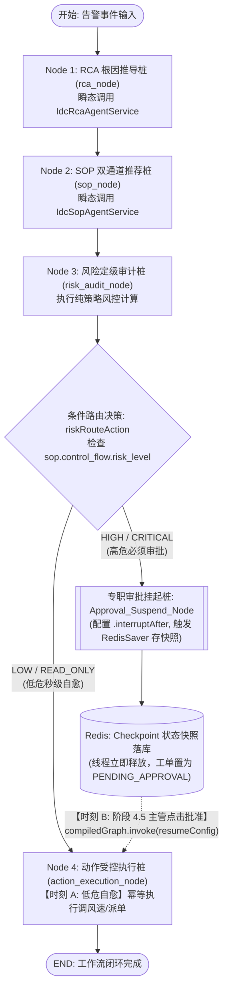

# 《智维云 (SmartIDC)》阶段 4.4：StateGraph 专用审批挂起网关、条件路由分流与 RedisSaver 物理断点详细执行方案

> **本阶段核心目标**：  
> 1. **破局静态拦截器痛点**：规避在判定节点（`Risk_Audit_Node`）直接配置 `.interruptAfter` 导致低危自愈任务被无差别误杀暂停的重大缺陷。通过 **条件路由边 (`addConditionalEdges`) + 专用虚拟审批挂起网关 (`Approval_Suspend_Node`)**，实现低危秒级自愈直达 `END`、高危任务精准分流至挂起桩瞬间冻结并释放工作线程；  
> 2. **Node 4 幂等性与“双重人格”**：赋予 `Action_Execution_Node` 两个时刻的执行职责（低危直接流转下发、高危 4.5 主管唤醒恢复执行），内部内置并发防重与幂等校验，对接已批准参数并产出 `ActionExecutionResultDTO` 执行回执；  
> 3. **RedisSaver 物理快照持久化**：挂起瞬间自动触发 `RedisSaver` 将包含 RCA 诊断报告、SOP 双通道建议及全局状态的 `Checkpoint` 完整落库，反序列化验证零字段丢失；  
> 4. **4.4 与 4.5 边界严谨收敛**：阶段 4.4 聚焦于 **Java 服务层与单测层** 的拓扑闭查、条件分流与快照可靠性断言；阶段 4.5 聚焦于 **Spring MVC Web 接口、数字孪生大屏 SSE 推流打字机与主管在线审批 `resume()` 唤醒闭环**。

---

## 一、 核心有向图拓扑与条件分流架构设计

### 1.1 静态拦截器陷阱与破局拓扑

在 Spring AI Alibaba / StateGraph（底层对齐 LangGraph）中，编译期声明的 `.interruptAfter("NodeId")` 属于**静态节点拦截器**。如果将其配置在负责判定的 `Risk_Audit_Node` 上，状态机引擎将在该节点执行完毕后无差别强行暂停，导致单机温升等低危自愈动作也必须等待人工审批，丧失 AIOps 秒级自愈能力。

**破局方案**：将安全判定与挂起动作在图拓扑中拆解，通过 `addConditionalEdges` 动态路由：

```
                                 ┌── (LOW / READ_ONLY) ──> [ Node 4: Action_Execution_Node ] ──> END
[ Node 3: Risk_Audit_Node ] ────┤
                                 └── (HIGH / CRITICAL) ──> [ Approval_Suspend_Node ] (静态配置 interruptAfter)
                                                                            │
                                                                           ▼ (阶段 4.5 主管审批 resume 唤醒后流转)
                                                             [ Node 4: Action_Execution_Node ] ──> END
```

### 1.2 全链路拓扑执行流 Mermaid



---

## 二、 Node 4 的幂等性与“双重人格”规范

Node 4 (`Action_Execution_Node`) 在整个 AIOps 闭环中承担双重时刻的执行动作：

| 维度 | 时刻 A：低危自愈时刻 | 时刻 B：高危恢复时刻 (阶段 4.5) |
| :--- | :--- | :--- |
| **触发来源** | 状态机内部 `riskRouteAction` 条件边自动流转进入 | 主管在大屏抽屉点击【批准】，Web 接口调用 `resume()` 唤醒流转进入 |
| **前置条件** | `risk_audit_decision == AUTO_APPROVED` | 经主管确认签名，`risk_audit_decision == NEED_APPROVAL` 且处于恢复链路 |
| **动作执行** | 调用低危控制桩（如调高风机转速至 80%、自动派发二级巡检工单） | 调用高危倒闸桩（如切换至备用 B 供电回路、隔离跳闸冷机） |
| **状态回执** | 状态键更新为 `EXECUTION_RESULT`，`status = COMPLETED` | 状态键更新为 `EXECUTION_RESULT`，`status = COMPLETED` |
| **幂等防重机制** | 1. 检查全局 State 中是否已有非空的 `EXECUTION_RESULT`；<br>2. 校验 `executionStatus == SUCCESS`，若已执行则跳过实际硬件调用，直接返回已有回执；<br>3. 写入带有唯一流水号的 `ActionExecutionResultDTO`。 |

---

## 三、 详细开发落地任务分解

### 任务 1：定义 StateKeys 与执行回执模型

#### 1.1 全局状态键常量类：[StateKeys.java](file:///d:/SmartIDC/smartidc-aiops/src/main/java/com/smartidc/aiops/graph/StateKeys.java)
- **文件路径**：`smartidc-aiops/src/main/java/com/smartidc/aiops/graph/StateKeys.java`
- **设计要求**：集中管理工作流所有 Key，规避硬编码字符串。
```java
package com.smartidc.aiops.graph;

/**
 * StateGraph 全局状态键常量契约
 */
public final class StateKeys {
    private StateKeys() {}

    /** 原始告警输入上下文 DTO / Map */
    public static final String ALARM_INPUT = "alarm_input";
    /** 机柜编码 */
    public static final String RACK_CODE = "rack_code";
    /** 故障表象 */
    public static final String FAULT_SYMPTOM = "fault_symptom";
    /** 租户标识 */
    public static final String TENANT_ID = "tenant_id";
    /** 全链路追踪 ID / Thread ID */
    public static final String TRACE_ID = "trace_id";
    /** Node 1 产出: RCA 根因诊断报告 */
    public static final String RCA_REPORT = "rca_report";
    /** Node 2 产出: SOP 双通道推荐预案 */
    public static final String SOP_RECOMMENDATION = "sop_recommendation";
    /** Node 3 产出: 风险风控审计决策 (AUTO_APPROVED / NEED_APPROVAL) */
    public static final String RISK_AUDIT_DECISION = "risk_audit_decision";
    /** 全局生命周期状态 (RUNNING / PENDING_APPROVAL / HITL_SUSPENDED / COMPLETED) */
    public static final String STATUS = "status";
    /** Node 4 产出: 下发受控执行回执与工单号 */
    public static final String EXECUTION_RESULT = "execution_result";
}
```

#### 1.2 动作执行回执契约 DTO：[ActionExecutionResultDTO.java](file:///d:/SmartIDC/smartidc-aiops/src/main/java/com/smartidc/aiops/domain/dto/ActionExecutionResultDTO.java)
- **文件路径**：`smartidc-aiops/src/main/java/com/smartidc/aiops/domain/dto/ActionExecutionResultDTO.java`
- **核心字段**：
  - `executionId`: 唯一执行流水号（如 `EXEC-20260921-7A1B`）
  - `ticketId`: 关联的运维工单编号
  - `actionName`: 动作编码（如 `ADJUST_FAN_SPEED`, `CIRCUIT_FAILOVER`）
  - `targetDevice`: 目标设备编码（如 `FAN-CAB-01`, `UPS-A02`）
  - `executionStatus`: 状态（`SUCCESS`, `FAILED`, `SIMULATED_ENGAGED`）
  - `executedAt`: 执行时间戳
  - `receiptMessage`: 详细执行回执（如：“[自愈成功] 冷通道天窗风机转速已上调至 80%，出风温度下降至 24.5℃”）
  - 实现 `Serializable`，兼容 `RedisSaver` 的 `GenericJackson2JsonRedisSerializer` 反序列化。

---

### 任务 2：实现五大核心节点与路由边

在 [IdcAioPsStateGraphService.java](file:///d:/SmartIDC/smartidc-aiops/src/main/java/com/smartidc/aiops/graph/IdcAioPsStateGraphService.java) 中重构节点拓扑与装配逻辑：

#### 2.1 节点命名常量声明
```java
public static final String NODE_RCA = "RCA_NODE";
public static final String NODE_SOP = "SOP_NODE";
public static final String NODE_RISK_AUDIT = "RISK_AUDIT_NODE";
public static final String NODE_APPROVAL_SUSPEND = "APPROVAL_SUSPEND_NODE";
public static final String NODE_ACTION_EXECUTION = "ACTION_EXECUTION_NODE";
```

#### 2.2 节点 1：RCA 诊断推导 (`executeRcaNode`)
- 包装 4.3 成果 `IdcRcaAgentService.diagnoseRack`；
- 从 State 提取 `rack_code`, `fault_symptom`, `tenant_id`, `trace_id`；
- 将 `RcaReportDTO` 写入 State 的 `StateKeys.RCA_REPORT`。

#### 2.3 节点 2：SOP 预案推荐 (`executeSopNode`)
- 包装 4.3 成果 `IdcSopAgentService.recommendSop`；
- 从 State 提取 `rca_report`，生成双通道预案；
- 将 `SopRecommendationDTO` 写入 State 的 `StateKeys.SOP_RECOMMENDATION`。

#### 2.4 节点 3：纯策略风控审计 (`executeRiskAuditNode`)
- **纯粹计算，绝不挂起**：读取 `SopRecommendationDTO.getControlFlow().getRiskLevel()`；
- 判定规则：
  - 若为 `CRITICAL` 或 `HIGH` ➔ 写入 `RISK_AUDIT_DECISION = "NEED_APPROVAL"`，`STATUS = "PENDING_APPROVAL"`；
  - 若为 `LOW` 或 `READ_ONLY` ➔ 写入 `RISK_AUDIT_DECISION = "AUTO_APPROVED"`，`STATUS = "AUTO_APPROVED"`。

#### 2.5 专用审批挂起桩：(`executeApprovalSuspendNode`)
- 专门承接高危路径的停靠桩：
```java
private Map<String, Object> executeApprovalSuspendNode(OverAllState state) {
    String traceId = state.value(StateKeys.TRACE_ID, String.class).orElse("N/A");
    String riskDecision = state.value(StateKeys.RISK_AUDIT_DECISION, String.class).orElse("NEED_APPROVAL");
    log.warn("⚠️ [StateGraph::ApprovalSuspendNode] 拦截到高危操作，当前流程进入挂起桩！traceId: {}, decision: {}", traceId, riskDecision);
    
    Map<String, Object> update = new HashMap<>();
    update.put(StateKeys.STATUS, "HITL_SUSPENDED");
    return update;
}
```

#### 2.6 节点 4：动作受控执行桩 (`executeActionExecutionNode`) —— 幂等防重
```java
private Map<String, Object> executeActionExecutionNode(OverAllState state) {
    String traceId = state.value(StateKeys.TRACE_ID, String.class).orElse("N/A");
    String status = state.value(StateKeys.STATUS, String.class).orElse("AUTO_APPROVED");
    SopRecommendationDTO sop = state.value(StateKeys.SOP_RECOMMENDATION, SopRecommendationDTO.class).orElse(null);

    // 1. 幂等性防御：检查是否已有执行成功的回执
    Optional<ActionExecutionResultDTO> existingResult = state.value(StateKeys.EXECUTION_RESULT, ActionExecutionResultDTO.class);
    if (existingResult.isPresent() && "SUCCESS".equals(existingResult.get().getExecutionStatus())) {
        log.info("🔁 [StateGraph::ActionExecutionNode] 检测到已存在成功执行回执，跳过重复执行 (幂等防护), traceId: {}", traceId);
        return Map.of();
    }

    log.info("⚡ [StateGraph::ActionExecutionNode] 进入受控执行逻辑, status: {}, traceId: {}", status, traceId);

    // 2. 根据上下文区分 时刻 A (低危自愈) 与 时刻 B (高危审批后恢复)
    String actionName;
    String targetDevice;
    String receiptMessage;

    if (sop != null && sop.getControlFlow() != null) {
        actionName = sop.getControlFlow().getActionName();
        targetDevice = sop.getControlFlow().getTargetDevice();
    } else {
        actionName = "ADJUST_FAN_SPEED";
        targetDevice = state.value(StateKeys.RACK_CODE, String.class).orElse("UNKNOWN");
    }

    if ("HITL_SUSPENDED".equals(status) || "PENDING_APPROVAL".equals(status)) {
        // 时刻 B: 主管审批后恢复执行
        receiptMessage = String.format("[主管核准执行] 设备 %s 已完成高危倒闸动作: %s，系统指标回稳", targetDevice, actionName);
    } else {
        // 时刻 A: 低危自动自愈下发
        receiptMessage = String.format("[低危自愈闭环] 设备 %s 已自动调节参数动作: %s，巡检工单已自动报备", targetDevice, actionName);
    }

    ActionExecutionResultDTO executionResult = new ActionExecutionResultDTO();
    executionResult.setExecutionId("EXEC-" + UUID.randomUUID().toString().substring(0, 8).toUpperCase());
    executionResult.setTicketId(System.currentTimeMillis() % 1000000L);
    executionResult.setActionName(actionName);
    executionResult.setTargetDevice(targetDevice);
    executionResult.setExecutionStatus("SUCCESS");
    executionResult.setExecutedAt(LocalDateTime.now().format(DateTimeFormatter.ISO_LOCAL_DATE_TIME));
    executionResult.setReceiptMessage(receiptMessage);

    Map<String, Object> update = new HashMap<>();
    update.put(StateKeys.EXECUTION_RESULT, executionResult);
    update.put(StateKeys.STATUS, "COMPLETED");
    return update;
}
```

---

### 任务 3：配置条件路由边（`addConditionalEdges`）与拓扑编译

#### 3.1 编写条件路由决策函数：`riskRouteAction`
```java
public String riskRouteAction(OverAllState state) {
    SopRecommendationDTO sop = state.value(StateKeys.SOP_RECOMMENDATION, SopRecommendationDTO.class).orElse(null);
    String riskLevel = "LOW";
    if (sop != null && sop.getControlFlow() != null && sop.getControlFlow().getRiskLevel() != null) {
        riskLevel = sop.getControlFlow().getRiskLevel().trim().toUpperCase();
    }

    if ("CRITICAL".equals(riskLevel) || "HIGH".equals(riskLevel)) {
        log.warn("⚠️ [条件路由边] 风险等级评估为 [{}]，精准分流至专职审批挂起桩 APPROVAL_SUSPEND_NODE", riskLevel);
        return NODE_APPROVAL_SUSPEND;
    }

    log.info("🟢 [条件路由边] 风险等级评估为 [{}]，直接分流至自愈执行节点 ACTION_EXECUTION_NODE", riskLevel);
    return NODE_ACTION_EXECUTION;
}
```

#### 3.2 注册拓扑结构与精准挂起编译
在 `IdcAioPsStateGraphService.buildWorkflowGraph()` 中装配：
```java
// 1. 注入 RedisSaver
@Autowired
private RedisSaver redisSaver;

// 2. 状态替换策略
StateGraph graph = new StateGraph("idcAioPsWorkflow", () -> {
    Map<String, KeyStrategy> strategies = new HashMap<>();
    strategies.put(StateKeys.ALARM_INPUT, new ReplaceStrategy());
    strategies.put(StateKeys.RACK_CODE, new ReplaceStrategy());
    strategies.put(StateKeys.FAULT_SYMPTOM, new ReplaceStrategy());
    strategies.put(StateKeys.TENANT_ID, new ReplaceStrategy());
    strategies.put(StateKeys.TRACE_ID, new ReplaceStrategy());
    strategies.put(StateKeys.RCA_REPORT, new ReplaceStrategy());
    strategies.put(StateKeys.SOP_RECOMMENDATION, new ReplaceStrategy());
    strategies.put(StateKeys.RISK_AUDIT_DECISION, new ReplaceStrategy());
    strategies.put(StateKeys.STATUS, new ReplaceStrategy());
    strategies.put(StateKeys.EXECUTION_RESULT, new ReplaceStrategy());
    return strategies;
});

// 3. 注册五大节点
graph.addNode(NODE_RCA, node_async((NodeAction) this::executeRcaNode));
graph.addNode(NODE_SOP, node_async((NodeAction) this::executeSopNode));
graph.addNode(NODE_RISK_AUDIT, node_async((NodeAction) this::executeRiskAuditNode));
graph.addNode(NODE_APPROVAL_SUSPEND, node_async((NodeAction) this::executeApprovalSuspendNode));
graph.addNode(NODE_ACTION_EXECUTION, node_async((NodeAction) this::executeActionExecutionNode));

// 4. 串联分析诊断链条
graph.addEdge(START, NODE_RCA);
graph.addEdge(NODE_RCA, NODE_SOP);
graph.addEdge(NODE_SOP, NODE_RISK_AUDIT);

// 5. 核心条件分支边：通过 edge_async 注册动态路由
graph.addConditionalEdges(
    NODE_RISK_AUDIT,
    edge_async((EdgeAction) this::riskRouteAction),
    Map.of(
        NODE_APPROVAL_SUSPEND, NODE_APPROVAL_SUSPEND,
        NODE_ACTION_EXECUTION, NODE_ACTION_EXECUTION
    )
);

// 6. 挂起桩在 4.5 阶段唤醒后流转至执行节点
graph.addEdge(NODE_APPROVAL_SUSPEND, NODE_ACTION_EXECUTION);
graph.addEdge(NODE_ACTION_EXECUTION, END);

// 7. 编译：将 interruptAfter 仅锁定在 APPROVAL_SUSPEND_NODE，低危任务零中断！
return graph.compile(CompileConfig.builder()
    .saverConfig(SaverConfig.builder().register(redisSaver).build())
    .interruptAfter(NODE_APPROVAL_SUSPEND) // 仅挂起专职审批桩
    .build());
```

---

### 任务 4：编写阶段 4.4 自动化集成测试 (`Phase4StateGraphWorkflowTest`)

创建测试文件：`smartidc-aiops/src/test/java/com/smartidc/aiops/Phase4StateGraphWorkflowTest.java`

#### 4.1 用例 1（低危自愈闭环断言 - `testLowRiskSelfHealingFlow`）
- **输入构造**：机柜 `RACK-B01`（单机温升微热），`faultSymptom = "单机柜微热告警"`；
- **执行流程**：`stateGraphService.runWorkflow("RACK-B01", "单机柜微热告警", "000000", traceId)`；
- **严密断言**：
  1. `assertNotNull(finalState, "工作流必须正常返回 State")`;
  2. `assertEquals("COMPLETED", finalState.value(StateKeys.STATUS, String.class).orElse(null))`;
  3. `assertEquals("AUTO_APPROVED", finalState.value(StateKeys.RISK_AUDIT_DECISION, String.class).orElse(null))`;
  4. `assertTrue(finalState.value(StateKeys.EXECUTION_RESULT, ActionExecutionResultDTO.class).isPresent(), "必须生成执行回执")`;
  5. 检查 `executionResult.getExecutionStatus()` 为 `"SUCCESS"`，回执内容包含自愈调速信息；
  6. **工作流全程畅通直达 END，中途绝无挂起，耗时秒级**。

#### 4.2 用例 2（高危精准挂起与 RedisSaver 快照断言 - `testHighRiskPrecisionSuspendAndRedisSnapshot`）
- **输入构造**：机柜 `RACK-A01`（冷机跳闸高危场景），`faultSymptom = "精密空调冷机压缩机跳闸过温告警"`；
- **执行流程**：`stateGraphService.runWorkflow("RACK-A01", ...)`；
- **严密断言**：
  1. **执行阻断断言**：工作流在 `APPROVAL_SUSPEND_NODE` 后立即中断退出，**状态中绝不存在 `EXECUTION_RESULT`**（未偷跑 Node 4）；
  2. **内存状态断言**：返回的 State 中 `status` 为 `"HITL_SUSPENDED"`，`risk_audit_decision` 为 `"NEED_APPROVAL"`；
  3. **RedisSaver 物理快照存在性断言**：  
     通过 `redisSaver.get(RunnableConfig.builder().threadId(traceId).build())` 查询快照，断言 `checkpoint.isPresent()` 为 `true`；
  4. **RedisSaver 序列化完整性断言**：  
     - 从 `checkpoint.get().getState()` 取出 `rca_report`，断言完整还原为 `RcaReportDTO`，目标机柜为 `RACK-A01`，且包含排查步骤与根因结论；
     - 取出 `sop_recommendation`，断言完整还原为 `SopRecommendationDTO`，`control_flow.risk_level` 值为 `"CRITICAL"` 或 `"HIGH"`，动作列表与操作步骤无损；
  5. **物理节点停靠断言**：断言 `checkpoint.get().getNodeId()` 准确停留在 `"APPROVAL_SUSPEND_NODE"`，`getNextNodeId()` 为 `"ACTION_EXECUTION_NODE"`。

---

## 四、 阶段 4.4 与 4.5 的职责边界清晰对照表

| 维度 | 阶段 4.4 建设终点 (本阶段) | 阶段 4.5 建设起点 (下一阶段) |
| :--- | :--- | :--- |
| **执行环境** | **Java 服务层与单元测试层** | **Spring MVC Web 控制器与前端大屏** |
| **拓扑结构** | 完成条件分支边与专用挂起桩，装配 RedisSaver | 保持 4.4 编译完成的 StateGraph 原样运行 |
| **挂起动作** | 触发 `interruptAfter`，完成 **Redis 快照物理落库**，释放工作线程 | 通过 SSE 长链接向前端大屏推送 `event: hitl_interrupt` 审批卡片 |
| **唤醒动作** | 单测内断言 Redis 快照可读、RCA 与 SOP 字段完整 | 主管在前端抽屉点击【批准】，调用 `POST /api/v1/aiops/ticket/resume`，触发 `compiledGraph.invoke(resumeConfig)` |
| **Node 4 行为** | 承接低危自愈执行，并提供高危恢复执行逻辑与幂等防重 | 在主管批准后由唤醒线程走完 Node 4，并向大屏推送最终执行完毕通知 |

---

## 五、 阶段 4.4 验收基准清单

- [ ] **StateKeys 常量定义**：创建 `StateKeys.java`，统一管理 10 个状态键常量。
- [ ] **ActionExecutionResultDTO 契约**：创建 `ActionExecutionResultDTO.java`，支持 Jackson 多态序列化。
- [ ] **条件路由边生效**：`addConditionalEdges` 结合 `riskRouteAction` 实现高低危精准分流。
- [ ] **静态拦截器精准锁定**：`.interruptAfter(NODE_APPROVAL_SUSPEND)` 仅挂起专职停靠桩，绝不误杀低危自愈。
- [ ] **Node 4 幂等防重保障**：防范重复调用，支持“低危自动下发”与“高危审批恢复”双重人格。
- [ ] **低危自愈单测 PASS**：`testLowRiskSelfHealingFlow` 运行成功，零挂起直达 END，回执完整。
- [ ] **高危挂起单测 PASS**：`testHighRiskPrecisionSuspendAndRedisSnapshot` 运行成功，精准停留在挂起桩。
- [ ] **Redis 快照反序列化验证**：从 Redis 成功反序列化还原 `RcaReportDTO` 与 `SopRecommendationDTO`，字段 100% 完整无损。
