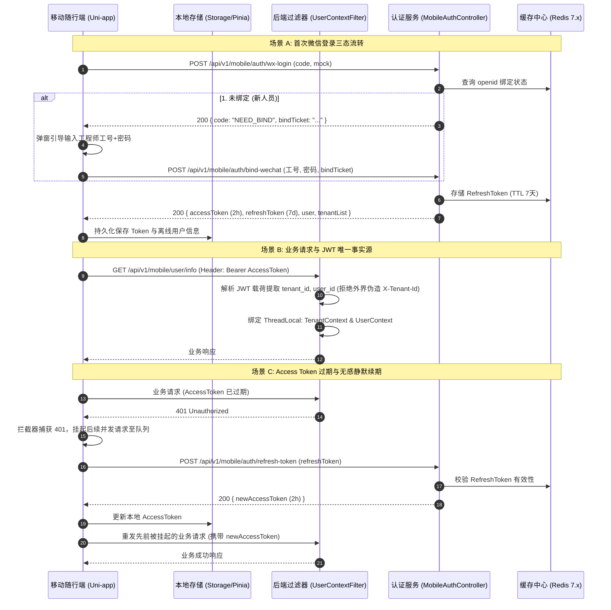

# 📱 Phase 5.1 实施方案：Uni-app 移动随行端工程架构、工业级双Token与多租户认证接入

> **阶段定位**：研发驻场工程师移动随行端（Uni-app + Vue3 + TS）工程基座，落地高安全级别的微信/账密双模式登录、双 Token 静默续期、JWT 唯一权威源多租户鉴权，并建立 IDC 机房弱网离线容灾机制与跨端环境抹平。  
> **核心基准**：严格解决原规划中的“Token 割裂、租户越权、微信乱入、无网白屏、跨端不平、边界膨胀”6 大缺陷。  
> **执行职责**：本任务仅聚焦移动端脚手架、认证网关与路由桩，严禁提前侵入 T5.2（微画像）和 T5.3（离线水印存证）。

---

## 一、 工业级架构修正与核心时序

### 1. 认证鉴权与双 Token 静默续期全景时序



---

## 二、 6 大关键缺陷针对性工业级改造

### 1. 认证机制：双 Token 体系与无感续期
- **Access Token**：有效期 **2 小时**，采用标准无状态 JWT（包含 `userId`, `username`, `tenantId`, `roleKey` 等 Claim），用于日常高频业务请求。
- **Refresh Token**：有效期 **7 天**，高熵随机凭证，写入 Redis，Key 结构为：  
  `smartidc:auth:refresh:{refreshToken}` -> 存储 `{userId, tenantId, roleKey}`。
- **即时吊销与离职封禁**：当工程师离职或设备遗失，后端调用 Redis `DEL smartidc:auth:refresh:{token}` 即可秒级切断续期，无需重启服务。
- **客户端拦截器 (`request.ts`)**：
  - 维护 `isRefreshing` 互斥标志与 `refreshSubscribers: Function[]` 挂起队列。
  - 当收到 HTTP `401` 时，若不在刷新中，则触发刷新；后续并发请求压入队列；
  - 刷新成功后批量唤醒队列中的请求重发；若 Refresh Token 也过期，清空本地状态并重定向至登录页。

### 2. 多租户安全：JWT 唯一权威源，杜绝水平越权
- **单一事实源原则**：
  - 后端 `UserContextFilter` **严禁直接信任前端传入的 `Tenant-Id` 请求头**。
  - 过滤器强制从受签名的 JWT 载荷中解出 `tenant_id`，并注入 `TenantContext.setTenantId(jwtTenantId)`。
  - MyBatis-Plus 的 `TenantLineHandler` 自动拼接的 `tenant_id = ?` 条件，其值 100% 溯源自合规签发的 JWT。
- **租户切换闭环**：
  - 接口：`POST /api/v1/mobile/auth/switch-tenant?targetTenantId=T20002`
  - 后端强校验：核验当前 `userId` 在系统用户租户授权中确实具备 `targetTenantId` 访问权；
  - 签发携带新 `targetTenantId` 的 Access Token，客户端 Pinia 状态同步更新。

### 3. 微信用户绑定三态机制：彻底阻断“任意微信扫码即成工程师”
- **状态 1: `LOGIN_SUCCESS` (已认证)**：
  - `openid` 已绑定有效驻场工程师（`role_key = 'engineer'` 或 `supervisor`），且 `status = 0 (正常)`，直接签发双 Token 放行。
- **状态 2: `NEED_BIND` (待工号激活绑定)**：
  - 未查询到该 `openid` 绑定的工程师记录，后端生成具有 10 分钟有效期的临时凭证 `bindTicket`（存入 Redis）；
  - 小程序端弹出“工程师身份核验绑定”卡片，要求输入 IDC 运维工号与初始密码；
  - 调用 `POST /api/v1/mobile/auth/bind-wechat`，核验成功后将 `openid` 与该工号绑定，正式激活。
- **状态 3: `UNAUTHORIZED_ACCESS` (未授权人员 / 账号封禁)**：
  - 账号处于停用状态（`status = 1`）或非内部工程师角色，直接拒绝，提示“未授权人员，严禁访问 IDC 机房动环”。
- **开发与本地 Mock 适配**：
  - 接口支持入参 `mock=true`（仅在 `dev/test` 环境开放），本地调试时可无需微信 AppID，直接模拟测试工程师身份（如工号 `ENG-001`）获取登录凭证。

### 4. 机房弱网与屏蔽空间离线容灾策略
- **Pinia 本地持久化**：
  - 集成 `pinia-plugin-persistedstate`，并针对 Uni-app 封装适配器：
    ```typescript
    storage: {
      getItem: (key) => uni.getStorageSync(key),
      setItem: (key, value) => uni.setStorageSync(key, value),
      removeItem: (key) => uni.removeStorageSync(key)
    }
    ```
  - 将 Token、当前租户信息、离线基础机房字典持久化在手机本地存储中。
- **网络状态感知与降级**：
  - `App.vue` 启动时注册 `uni.onNetworkStatusChange` 监听器；
  - `request.ts` 捕获断网异常（`fail` 回调且网络不可达），优雅展示顶部“当前处于冷通道屏蔽弱网环境”黄色指示条，杜绝组件因网络异常抛出未捕获错误导致白屏；
  - 核心只读数据（如最近巡检机柜历史、个人离线凭证）支持从 Storage 降级读取。

### 5. 跨端环境抹平与条件编译规范
- **API 域名与 BaseURL 注入 (`src/config/env.ts`)**：
  - **H5 环境 (`#ifdef H5`)**：BaseURL 设为 `/api`，通过 Vite 的 `server.proxy` 转发至后端 `http://localhost:8080`，免除跨域限制；
  - **微信小程序环境 (`#ifdef MP-WEIXIN`)**：BaseURL 读取环境变量中配置的 HTTPS 规范域名（如 `https://smartidc-api.example.com`），支持在局域网联调时配置直接 IP。
- **登录界面自适应渲染 (`src/pages/login/index.vue`)**：
  - 小程序环境下渲染：【微信一键授权快捷登录】主按钮 + 【工号密码兜底】次入口；
  - H5 环境下通过条件编译直接隐藏微信授权按钮，直出工号密码登录表单。

### 6. 任务边界收敛与页面路由桩规划
- **本阶段仅实现路由空桩 (Empty Stubs)**，严禁提前编写具体微画像画图与 Canvas 水印代码：
  - `/pages/index/index.vue`（移动随行端控制台主页骨架）
  - `/pages/login/index.vue`（微信/账密双模式登录与首绑页）
  - `/pages/rack/profile.vue`（机柜微画像占位桩）
  - `/pages/ticket/list.vue`（工单列表占位桩）
  - `/pages/my/index.vue`（个人中心与租户切换）

---

## 三、 详细代码实现与契约规格

### 1. 后端接口与 DTO 契约 (`smartidc-admin` / `smartidc-biz`)

#### 1.1 移动端登录请求与响应 DTO
- **`WxLoginRequestDTO.java`**：
  ```java
  package com.smartidc.biz.domain.dto.mobile;

  import io.swagger.v3.oas.annotations.media.Schema;
  import jakarta.validation.constraints.NotNull;
  import lombok.Data;

  @Data
  @Schema(description = "微信小程序登录入参")
  public class WxLoginRequestDTO {
      @Schema(description = "微信临时登录凭证 code")
      private String code;

      @Schema(description = "是否启用本地离线 Mock 模式 (dev/test 生效)")
      private Boolean mock = false;

      @Schema(description = "Mock 工程师工号 (mock=true 时生效)")
      private String mockUserCode;
  }
  ```
- **`WxBindRequestDTO.java`**：
  ```java
  package com.smartidc.biz.domain.dto.mobile;

  import io.swagger.v3.oas.annotations.media.Schema;
  import jakarta.validation.constraints.NotBlank;
  import lombok.Data;

  @Data
  @Schema(description = "微信账号与工程师工号首绑入参")
  public class WxBindRequestDTO {
      @NotBlank(message = "绑定临时凭证不可为空")
      private String bindTicket;

      @NotBlank(message = "工程师工号/账号不可为空")
      private String username;

      @NotBlank(message = "账号初始密码不可为空")
      private String password;
  }
  ```
- **`MobileLoginVO.java`**：
  ```java
  package com.smartidc.biz.domain.vo.mobile;

  import io.swagger.v3.oas.annotations.media.Schema;
  import lombok.AllArgsConstructor;
  import lombok.Builder;
  import lombok.Data;
  import lombok.NoArgsConstructor;
  import java.util.List;

  @Data
  @Builder
  @NoArgsConstructor
  @AllArgsConstructor
  @Schema(description = "移动端认证出参")
  public class MobileLoginVO {
      @Schema(description = "业务响应状态: LOGIN_SUCCESS / NEED_BIND / UNAUTHORIZED_ACCESS")
      private String authState;

      @Schema(description = "首次绑定临时票据 (authState=NEED_BIND 时返回)")
      private String bindTicket;

      @Schema(description = "业务短期 Access Token (2小时)")
      private String accessToken;

      @Schema(description = "长期 Refresh Token (7天)")
      private String refreshToken;

      @Schema(description = "当前生效租户ID")
      private String currentTenantId;

      @Schema(description = "工程师用户信息")
      private EngineerUserVO user;

      @Schema(description = "该工程师被授权的租户列表")
      private List<TenantSimpleVO> tenantList;
  }
  ```

#### 1.2 认证控制器与服务层实现 (`MobileAuthController.java`)
- 落地核心接口：
  - `POST /api/v1/mobile/auth/wx-login`（微信登录三态判断）
  - `POST /api/v1/mobile/auth/bind-wechat`（首次登录工号密码绑定）
  - `POST /api/v1/mobile/auth/login`（工号密码兜底登录）
  - `POST /api/v1/mobile/auth/refresh-token`（使用 RefreshToken 置换新 AccessToken）
  - `POST /api/v1/mobile/auth/switch-tenant`（租户安全切换，签发新 Token）
  - `POST /api/v1/mobile/auth/logout`（主动登出，废除 Redis 中的 RefreshToken）

#### 1.3 后端安全过滤器改造 (`UserContextFilter.java`)
- 严格重构过滤逻辑：
  - 优先从 `Authorization: Bearer <token>` 解析已签名的 Claims；
  - 提取其中的 `tenant_id`、`user_id`、`role_key`；
  - **强制** `TenantContext.setTenantId(jwtTenantId)`，严禁外界伪造的 `Tenant-Id` 请求头覆盖！

---

### 2. 移动随行端工程架构 (`smartidc-app/`)

#### 2.1 目录规划与脚手架结构
```text
smartidc-app/
├── src/
│   ├── api/
│   │   ├── auth.ts              # 登录、首绑、静默刷新、租户切换接口
│   │   └── index.ts             # 统一导出
│   ├── config/
│   │   └── env.ts               # 跨端环境变量注入 (BaseURL、超时时间)
│   ├── pages/
│   │   ├── login/
│   │   │   └── index.vue        # 微信一键登录与工号首绑卡片
│   │   ├── index/
│   │   │   └── index.vue        # 移动随行端首页 (扫码入口、工单快捷入口)
│   │   ├── rack/
│   │   │   └── profile.vue      # 机柜微画像路由占位桩 (T5.2 落地)
│   │   ├── ticket/
│   │   │   └── list.vue         # 巡检排障工单路由占位桩 (T5.3 落地)
│   │   └── my/
│   │   │   └── index.vue        # 个人中心、租户切换抽屉、网络状态提示
│   ├── store/
│   │   ├── modules/
│   │   │   ├── auth.ts          # 双 Token 状态管理、租户切换、用户信息
│   │   │   └── network.ts       # 全局网络通断感知状态
│   │   └── index.ts             # Pinia + 持久化插件挂载
│   ├── utils/
│   │   ├── request.ts           # 工业级网络请求层 (401挂起队列、静默续期、弱网重试)
│   │   └── storage.ts           # Uni-app Storage 适配持久化工具
│   ├── App.vue                  # 网络监听、版本自检
│   ├── main.ts
│   ├── manifest.json            # 微信小程序 AppID、页面样式与权限配置
│   └── pages.json               # 路由分包与 TabBar 配置
├── package.json                 # Vue3, TS, Pinia, Pinia-plugin-persistedstate
├── tsconfig.json
└── vite.config.ts               # 跨端构建插件与 H5 Proxy 配置
```

#### 2.2 核心网络拦截器实现 (`src/utils/request.ts`)
```typescript
import { useAuthStore } from '@/store/modules/auth';
import { getEnvBaseUrl } from '@/config/env';

let isRefreshing = false;
let refreshSubscribers: ((token: string) => void)[] = [];

function onTokenRefreshed(token: string) {
  refreshSubscribers.forEach((cb) => cb(token));
  refreshSubscribers = [];
}

export function request<T = any>(options: UniApp.RequestOptions): Promise<T> {
  const authStore = useAuthStore();
  const baseUrl = getEnvBaseUrl();

  const url = options.url.startsWith('http') ? options.url : `${baseUrl}${options.url}`;
  const header = {
    ...options.header,
    Authorization: authStore.accessToken ? `Bearer ${authStore.accessToken}` : '',
    'X-Client-Platform': 'uni-app'
  };

  return new Promise((resolve, reject) => {
    uni.request({
      ...options,
      url,
      header,
      success: async (res) => {
        // 1. 拦截 HTTP 401: Access Token 过期
        if (res.statusCode === 401) {
          if (!authStore.refreshToken) {
            authStore.logout();
            uni.reLaunch({ url: '/pages/login/index' });
            return reject(new Error('登录凭证已失效'));
          }

          // 正在刷新中，将当前请求加入挂起等待队列
          if (isRefreshing) {
            return new Promise((retryResolve) => {
              refreshSubscribers.push((newToken: string) => {
                options.header = { ...options.header, Authorization: `Bearer ${newToken}` };
                retryResolve(request(options));
              });
            }).then(resolve).catch(reject);
          }

          // 开启单飞刷新
          isRefreshing = true;
          try {
            const success = await authStore.refreshAccessToken();
            if (success) {
              onTokenRefreshed(authStore.accessToken);
              options.header = { ...options.header, Authorization: `Bearer ${authStore.accessToken}` };
              const retryRes = await request<T>(options);
              return resolve(retryRes);
            } else {
              authStore.logout();
              uni.reLaunch({ url: '/pages/login/index' });
              return reject(new Error('会话过期，请重新登录'));
            }
          } catch (err) {
            authStore.logout();
            uni.reLaunch({ url: '/pages/login/index' });
            return reject(err);
          } finally {
            isRefreshing = false;
          }
        }

        // 2. 正常业务响应
        if (res.statusCode >= 200 && res.statusCode < 300) {
          const body: any = res.data;
          if (body && typeof body.code !== 'undefined' && body.code !== 200 && body.code !== 0) {
            return reject(new Error(body.message || '业务操作异常'));
          }
          return resolve(body?.data ?? body);
        }

        reject(new Error(`HTTP 异常 [${res.statusCode}]`));
      },
      fail: (err) => {
        // 弱网容灾提示
        uni.showToast({ title: '机房网络不稳定，已启用离线重试', icon: 'none' });
        reject(err);
      }
    });
  });
}
```

---

## 四、 T5.1 验收清单与质检基准

在向用户进行阶段汇报前，必须严格完成以下 4 大项指标的自检：

| 序号 | 验证维度 | 验证操作与断言标准 | 验收结论 |
| :--- | :--- | :--- | :--- |
| **V1** | **跨端工程编译** | 分别执行 `npm run dev:mp-weixin` 与 `npm run dev:h5`，构建全过程无 TypeScript 类型报错，生成产物合规。 | 待验证 |
| **V2** | **微信 Mock 离线登录** | 客户端向 `/api/v1/mobile/auth/wx-login` 传入 `{ mock: true, mockUserCode: "ENG-001" }`，断言返回 `LOGIN_SUCCESS`、双 Token 及工程师授权租户列表。 | 待验证 |
| **V3** | **首绑三态拦截验证** | 模拟新微信 `openid` 首次登录，断言返回 `NEED_BIND` 与 `bindTicket`；执行首绑接口后正常放行；未授权账号强阻断。 | 待验证 |
| **V4** | **租户切换与事实源测试** | 调用 `/api/v1/mobile/auth/switch-tenant?targetTenantId=T10001`，断言返回签发新租户的 Token；受保护接口解析的 `TenantContext` 与 Token 严格一致，外部伪造 Header 被彻底屏蔽。 | 待验证 |

---

## 五、 后续承接指引

完成 T5.1 验收后，将无缝切入后续阶段：
- **T5.2**: 调起 `uni.scanCode`，基于当前租户上下文请求 `/api/v1/mobile/rack/{rackCode}/profile` 渲染机柜微画像；
- **T5.3**: 离线 Canvas 水印加注与 MinIO 存证闭环。
