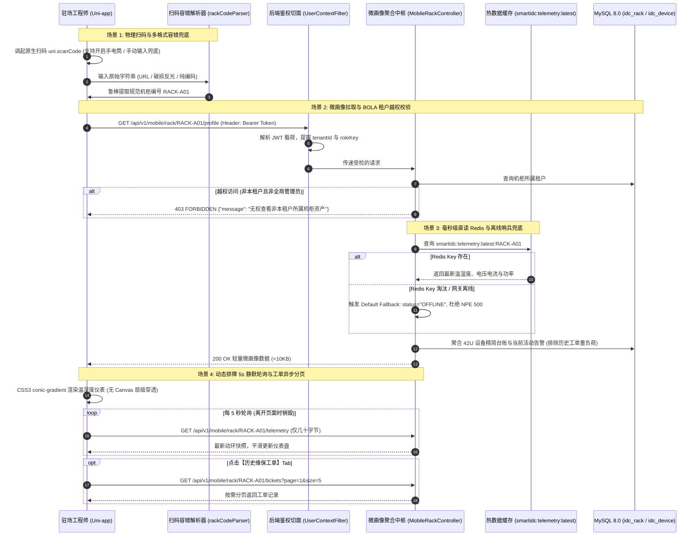

# 📱 Phase 5.2 实施方案：移动端扫码巡检与机柜微画像引擎

> **阶段定位**：研发驻场工程师移动随行端（微信小程序 / 移动H5）现场扫码巡检、鲁棒参数解析、BOLA 跨租户越权防护、毫秒级机柜微画像直读呈现、CSS3 无层级穿透双环动环仪表与 5 秒动态排障感知闭环。  
> **核心基准**：严格契合 [SDS.md](file:///d:/SmartIDC/SDS.md)、[all_plan.md](file:///d:/SmartIDC/all_plan.md) 与 [01_smartidc_schema.sql](file:///d:/SmartIDC/sql/01_smartidc_schema.sql)。  
> **执行职责**：聚焦于扫码解析、租户权限拦截、微画像聚合与动环动态渲染；严格杜绝提前编写 T5.3（离线水印拍照存证）和 T5.4（PUE 阶梯计费引擎）。

---

## 一、 工业级架构设计与数据流转拓扑



---

## 二、 6 大关键隐患针对性工业级改造

### 1. 扫码鲁棒解析与物理环境兜底
- **多格式编码兼容 (`src/utils/rackCodeParser.ts`)**：
  - 支持资产二维码为完整 URL：如 `https://smartidc.corp/assets/r/RACK-A01`，通过正则表达式 `/[?&]rackCode=([A-Za-z0-9-_]+)/i` 自动提取；
  - 支持直接资产编码：`RACK-A01`、`RACK_A01`、`A-01` 等，自动统一格式化为大写规范 `RACK-{zone}-{num}`；
  - 自动剥离首尾不可见字符、特殊控制符。
- **物理环境暗光补光**：
  - 扫码页面及首页提供【开启补光手电筒】快捷浮动开关，调用 `uni.setFlashlight({ flash: true })`，有效解决冷通道弱光对焦难题。
- **手动输入兜底 (Manual Input Fallback)**：
  - 二维码严重污损、反光或摄像头权限受限时，支持点击【手动输入机柜号】唤起模糊匹配弹窗，输入编号快速进入微画像。

### 2. BOLA / IDOR 跨租户越权安全防护
- **租户访问控制原则**：
  - 后端服务层从 `UserContext` 提取当前经过签名的 `tenantId` 与 `roleKey`。
  - **白名单放行**：当 `tenantId.equals("000000")`（机房运营总平台）或 `roleKey` 属于 `admin` / `supervisor`（数据中心主管）时，具备全机房巡检权限；
  - **普通租户工程师硬校验**：比对机柜表的 `tenant_id`，若机柜已被托管给特定租户且与当前工程师所属租户不匹配，**强制抛出 403 FORBIDDEN 业务异常**，严禁跨租户窃取服务器资产与告警信息。

### 3. 主次数据分离与弱网防 Over-fetching
- **核心微画像端点轻量化**：
  - `GET /api/v1/mobile/rack/{rackCode}/profile` 仅返回：机柜基础属性、最新动环指标、42U 槽位设备摘要、当前活动告警（红灯先亮），整个 JSON 体积控制在 $< 10\text{KB}$ 以内，弱网秒开。
- **历史维保工单按需分页加载**：
  - 历史工单单独分离为独立端点：`GET /api/v1/mobile/rack/{rackCode}/tickets?page=1&size=5`；
  - 前端微画像页面设计为 `[动环画像 / 42U设备]` 与 `[维保工单]` 双 Tab，初始仅渲染核心画像，工程师切换至工单 Tab 时才异步按需拉取，彻底规避首屏网络拥塞。

### 4. 动环直读 Redis 击穿与离线哨兵兜底
- **热数据直查机制**：
  - 读取 Redis Hash：`smartidc:telemetry:latest:{rackCode}`；
  - 读取逻辑使用安全的类型转换，杜绝直接强制强转引发的 ClassCastException 或 NPE；
- **离线哨兵兜底 (Default Fallback)**：
  - 若 Redis 中 Key 已经过期被淘汰，或传感器通信网关断线：
    - 接口返回 `telemetry.status = "OFFLINE"`；
    - 温湿度、电压电流等字段返回 `null`，保留 `last_heartbeat_time`（从 MySQL 快照表 `idc_telemetry_snapshot` 追溯最近一条心跳时间）；
    - 前端仪表盘优雅显示“动环离线/未上报”，机柜基础与设备列表正常回显，**坚决不抛 500 异常中断整个页面**。

### 5. 规避原生 Canvas 穿透，采用纯 CSS3 / SVG 双环仪表
- **小程序 Canvas 痛点**：原生 Canvas 组件具有最高的绘制层级，会导致下拉菜单、告警弹窗、维保操作抽屉被 Canvas 粗暴盖住，且在高分屏（Retina）上缩放极易发虚。
- **纯 CSS3 解决方案 (`src/components/GaugeMeter.vue`)**：
  - 采用现代 CSS3 `conic-gradient`（圆锥渐变）结合 CSS 变量 `@property` 绘制平滑环形仪表盘，或轻量级 SVG `stroke-dasharray` 动态圆弧；
  - 彻底规避小程序 `z-index` 层级穿透 Bug；
  - 天然适配高分屏，矢量高清无毛刺，且支持流畅的 CSS transition 动态数值过渡。

### 6. 轻量级 5 秒静默轮询与生命周期管理
- **排障动态感知**：
  - 针对现场工程师“拉开百叶窗/调整空调风阀后需要实时观察温度变化”的工况，提供超轻量级动环刷新端点：  
    `GET /api/v1/mobile/rack/{rackCode}/telemetry`（仅传输十几个字节的最新温湿度）；
  - 移动端页面在 `onShow` 生命周期开启 `setInterval` 5 秒静默轮询，平滑更新双环仪表；
- **防后台空耗**：
  - 在 Uni-app `onHide` 与 `onUnload` 生命周期中，必须严格执行 `clearInterval`，切断网络轮询，防止工程师切至后台拍照或锁屏时发生电池电量空耗与流量浪费。

---

## 三、 详细契约与代码规范

### 1. 后端接口与 DTO/VO 契约 (`smartidc-biz` / `smartidc-admin`)

#### 1.1 微画像核心出参 (`MobileRackProfileVO.java`)
```java
package com.smartidc.biz.domain.vo.mobile;

import io.swagger.v3.oas.annotations.media.Schema;
import lombok.AllArgsConstructor;
import lombok.Builder;
import lombok.Data;
import lombok.NoArgsConstructor;
import java.math.BigDecimal;
import java.time.LocalDateTime;
import java.util.List;

@Data
@Builder
@NoArgsConstructor
@AllArgsConstructor
@Schema(description = "移动端机柜微画像轻量聚合视图")
public class MobileRackProfileVO {

    @Schema(description = "机柜基础属性")
    private RackBaseInfoVO rackInfo;

    @Schema(description = "实时动环指标快照 (含离线哨兵状态)")
    private MobileRackTelemetryVO telemetry;

    @Schema(description = "42U 槽位设备摘要")
    private RackSlotSummaryVO uSlotsSummary;

    @Schema(description = "当前活动越限告警列表 (红灯先亮)")
    private List<MobileActiveAlarmVO> activeAlarms;

    @Data
    @Builder
    @NoArgsConstructor
    @AllArgsConstructor
    public static class RackBaseInfoVO {
        private Long rackId;
        private String rackCode;
        private String rackName;
        private String roomName;
        private String tenantId;
        private BigDecimal ratedPowerKva;
        private BigDecimal currentLoadRatio; // 负载率百分比
        private Integer status; // 0-空闲, 1-使用中, 2-维保中
    }

    @Data
    @Builder
    @NoArgsConstructor
    @AllArgsConstructor
    public static class RackSlotSummaryVO {
        private Integer totalU; // 默认 42
        private Integer usedU;
        private Integer freeU;
        private List<MobileSlotDeviceItemVO> mountedDevices;
    }

    @Data
    @Builder
    @NoArgsConstructor
    @AllArgsConstructor
    public static class MobileSlotDeviceItemVO {
        private Long deviceId;
        private String deviceCode;
        private String deviceName;
        private String deviceType; // IT_SERVER, IT_SWITCH 等
        private Integer startU;
        private Integer uHeight;
        private String status;
    }
}
```

#### 1.2 实时动环轻量 VO (`MobileRackTelemetryVO.java`)
```java
package com.smartidc.biz.domain.vo.mobile;

import io.swagger.v3.oas.annotations.media.Schema;
import lombok.AllArgsConstructor;
import lombok.Builder;
import lombok.Data;
import lombok.NoArgsConstructor;
import java.math.BigDecimal;
import java.time.LocalDateTime;

@Data
@Builder
@NoArgsConstructor
@AllArgsConstructor
@Schema(description = "移动端机柜动环指标轻量快照")
public class MobileRackTelemetryVO {
    @Schema(description = "传感器通信状态: ONLINE / OFFLINE")
    private String status;

    @Schema(description = "进风/环境温度 (℃)")
    private BigDecimal temp;

    @Schema(description = "出风口温度 (℃)")
    private BigDecimal returnTemp;

    @Schema(description = "相对湿度 (%RH)")
    private BigDecimal humidity;

    @Schema(description = "母线供电电压 (V)")
    private BigDecimal voltage;

    @Schema(description = "工作电流 (A)")
    private BigDecimal current;

    @Schema(description = "实时有效功率 (kW)")
    private BigDecimal powerKw;

    @Schema(description = "动环健康评级: HEALTHY / WARNING / CRITICAL / UNKNOWN")
    private String healthLevel;

    @Schema(description = "指标最新更新时间戳")
    private LocalDateTime updatedAt;
}
```

#### 1.3 历史维保工单独立分页 VO (`MobileWorkTicketPageVO.java`)
```java
package com.smartidc.biz.domain.vo.mobile;

import io.swagger.v3.oas.annotations.media.Schema;
import lombok.AllArgsConstructor;
import lombok.Builder;
import lombok.Data;
import lombok.NoArgsConstructor;
import java.time.LocalDateTime;
import java.util.List;

@Data
@Builder
@NoArgsConstructor
@AllArgsConstructor
@Schema(description = "机柜维保工单独立分页响应")
public class MobileWorkTicketPageVO {
    private Long total;
    private List<MobileWorkTicketItemVO> records;

    @Data
    @Builder
    @NoArgsConstructor
    @AllArgsConstructor
    public static class MobileWorkTicketItemVO {
        private Long ticketId;
        private String title;
        private String ticketType; // ALARM_REPAIR, ROUTINE_CHECK
        private Integer status;    // 0-待分配, 1-排障中, 5-待消警复核, 6-已办结
        private String statusText;
        private String operatorName;
        private LocalDateTime createTime;
    }
}
```

#### 1.4 REST 控制器端点设计 (`MobileRackController.java`)
- 统一定义在 `smartidc-biz/src/main/java/com/smartidc/biz/controller/mobile/MobileRackController.java`：
  - `GET /api/v1/mobile/rack/{rackCode}/profile`：聚合主画像（带 BOLA 租户校验）；
  - `GET /api/v1/mobile/rack/{rackCode}/telemetry`：超轻量 5s 轮询端点；
  - `GET /api/v1/mobile/rack/{rackCode}/tickets`：历史工单按需分页加载（`page`, `size`）。

---

### 2. 移动随行端核心组件与视图实现 (`smartidc-app/`)

#### 2.1 鲁棒扫码解析工具 (`src/utils/rackCodeParser.ts`)
```typescript
/**
 * 工业级机柜编码容错解析工具
 * 支持 URL Query、带前缀复合编码、纯编码格式过滤与首尾净化
 */
export function parseRackCode(scanResult: string): string | null {
  if (!scanResult) return null;
  const raw = scanResult.trim();

  // 1. 匹配带参 URL 格式: https://.../profile?rackCode=RACK-A01 或 ?code=RACK-A01
  const urlMatch = raw.match(/[?&](?:rackCode|code)=([A-Za-z0-9-_]+)/i);
  if (urlMatch && urlMatch[1]) {
    return urlMatch[1].toUpperCase();
  }

  // 2. 匹配 SmartIDC 专属深层链接: smartidc://rack/RACK-A01
  const schemeMatch = raw.match(/smartidc:\/\/rack\/([A-Za-z0-9-_]+)/i);
  if (schemeMatch && schemeMatch[1]) {
    return schemeMatch[1].toUpperCase();
  }

  // 3. 匹配标准机柜命名格式: RACK-A01 / RACK_A01 / A-01 / A01
  const codeMatch = raw.match(/(?:RACK[-_])?([A-Za-z0-9]+[-_][0-9]+)/i);
  if (codeMatch && codeMatch[0]) {
    let code = codeMatch[0].toUpperCase().replace('_', '-');
    if (!code.startsWith('RACK-')) {
      code = `RACK-${code}`;
    }
    return code;
  }

  // 4. 兜底纯字母数字清洗
  const clean = raw.replace(/[^A-Za-z0-9-_]/g, '').toUpperCase();
  return clean || null;
}
```

#### 2.2 纯 CSS3 / SVG 双环仪表组件 (`src/components/GaugeMeter.vue`)
- 替代原生 Canvas，使用纯 CSS3 渐变圆环；
- 参数：`value` (数值), `min`, `max`, `unit`, `title`, `theme` ('temp' | 'humidity')；
- 根据预警阈值自动切换颜色（绿色安全、橙色预警、红色越限）；
- 彻底解决小程序原生组件层级穿透与 Retina 模糊问题。

#### 2.3 工作台扫码与手动输入交互升级 (`src/pages/index/index.vue`)
- 【现场扫码】主按钮：调用 `uni.scanCode`，并提供扫码界面控制；
- 【手电筒开关】：调用 `uni.setFlashlight` 解决昏暗环境对焦；
- 【手动输入机柜】：点击弹窗输入工号/机柜编码快速跳转 `/pages/rack/profile?rackCode=...`。

#### 2.4 机柜微画像详情视图 (`src/pages/rack/profile.vue`)
- **首屏秒开**：通过 `getRackProfile` 拉取主画像并渲染；
- **5s 静默轮询**：`onShow` 启动轻量动环定时器，`onHide` / `onUnload` 严格执行销毁；
- **42U 槽位图**：直观展示已占用/空闲 U 位及在架设备列表；
- **双 Tab 异步按需加载**：切换至“维保工单”Tab 时才按需调用 `getRackTickets`。

---

## 四、 T5.2 验收清单与质检基准

在向用户汇报前，必须完成以下 4 大项验收验证：

| 序号 | 验证维度 | 验证操作与断言标准 | 验收结论 |
| :--- | :--- | :--- | :--- |
| **V1** | **扫码解析容错测试** | 编写单测验证 `parseRackCode`：分别输入 URL、`smartidc://` 深层链接、小写编码、首尾空格，断言均能 100% 格式化为 `RACK-A01`。 | 待验证 |
| **V2** | **BOLA 跨租户越权防护测试** | 模拟租户 `T10001` 工程师请求租户 `T20002` 的专属机柜 `RACK-B02`，断言返回 `403 FORBIDDEN`；平台主管 `000000` 访问正常放行。 | 待验证 |
| **V3** | **Redis 离线哨兵兜底测试** | 模拟 Redis 中清除机柜缓存，调用画像接口，断言返回 `status: "OFFLINE"`，系统 0 个 NPE 异常，基础资产正常渲染。 | 待验证 |
| **V4** | **跨端构建与无 Canvas 穿透** | 执行 `npm run build:mp-weixin` 与 `npm run build:h5`，编译 0 报错；CSS3 仪表盘在弹窗遮罩下无层级穿透。 | 待验证 |
