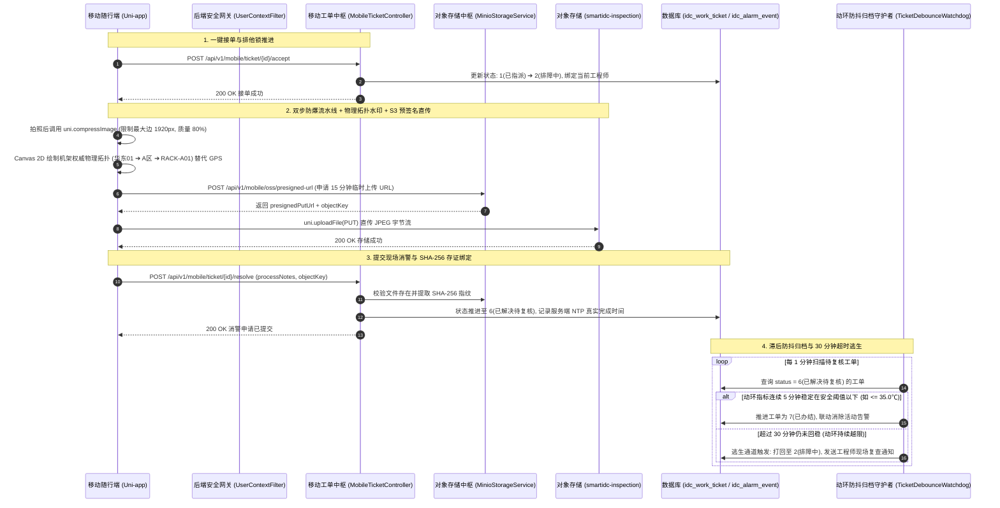

# 📱 Phase 5.3 实施方案：现场排障工单流转、双步防爆内存水印与 MinIO 预签名存证闭环

> **阶段定位**：研发驻场工程师移动随行端（Uni-app + Vue3 + TS）现场排障工单全生命周期闭环。彻底攻克 IDC 机房 **GPS 法拉第笼屏蔽、移动端高像素拍照 OOM 内存雪崩、客户端防伪时间不可信、MinIO 专网直传与动环温度边缘震荡误关单（Flapping）** 5 大工业级致命陷阱。  
> **核心基准**：严格契合 [SDS.md](file:///d:/SmartIDC/SDS.md)、[all_plan.md](file:///d:/SmartIDC/all_plan.md) 与 [01_smartidc_schema.sql](file:///d:/SmartIDC/sql/01_smartidc_schema.sql)。  
> **执行职责**：聚焦于工单接单/排障/挂起/消警流转、先压缩后绘制水印流水线、MinIO S3 预签名直传与滞后防抖自动归档引擎；严格杜绝提前编写 T5.4（PUE 阶梯计费）。

---

## 一、 工业级架构设计与时序流转全貌



---

## 二、 5 大关键物理与架构隐患针对性工业级改造

### 1. 物理环境致命冲突：机架资产权威物理拓扑替代 GPS 卫星定位
- **法拉第笼屏蔽与无网逆地址瘫痪**：
  IDC 机房为全钢架高密金属屏蔽结构，室内 GPS/北斗信号衰减殆尽，调用 `uni.getLocation` 必定超时报错；且在离线或专网环境下，外部逆地址解析（高德/腾讯地图 API）完全无法请求。
- **物理拓扑反查方案 (`src/utils/watermark.ts`)**：
  - 调用 `uni.getLocation` 增加 `fail` 捕获降级熔断，超时报错绝不阻塞水印渲染；
  - **以已扫码机柜的资产元数据为权威源**：直接从机柜详情中提取其机房层级全路径，例如：  
    `【机架权威物理位置】华东一号数据中心 ➔ A栋2层 ➔ A区冷通道 ➔ RACK-A01`；
  - 资产物理拓扑真实不可伪造，其法律存证与审计效力远超由于多径反射漂移数百米的室内 GPS。

### 2. 移动端内存雪崩：先前端压缩、后绘制水印的双步防爆流水线
- **高像素拍照内存风险**：
  手机 4000×3000 高清主摄解压成 RGBA 位图后单张占用近 $48\text{MB}$ 显存，若直接将其送入 Canvas `drawImage`，极易击穿小程序 200MB 内存上限导致闪退崩溃。
- **双步防爆流水线 (`WatermarkCamera.vue`)**：
  1. **第一步（有损降采样）**：调用 `uni.compressImage` 强制将图片最长边限制在 $1920\text{px}$ 以内，压缩质量设为 $80\%$，将内存占用骤降 80% 以上（文件体积缩减至 500KB~1.5MB）；
  2. **第二步（矢量文字叠加）**：将压缩后的临时路径喂给 Canvas 2D，绘制半透明暗色背景条、机架物理拓扑、工程师工号、本地时间戳与 SmartIDC 防伪校验码；
  3. **第三步（轻量导出）**：通过 `canvas.toDataURL('image/jpeg', 0.85)` 导出高质量压缩字节流。

### 3. 安全合规漏洞：服务端 NTP 授时打标与 SHA-256 存证防篡改
- **客户端防伪不可信治理**：
  工程师可通过修改手机系统时间或抓包篡改时间戳，客户端声称的“不可篡改”在审计上无效。
- **后端权威防伪双保险**：
  - **服务端强制打标**：工单提交消警时，后端强制以数据库服务器本地 NTP 同步时间作为 `resolve_time` 真实入库，绝不信任前端传入的任意时间参数；
  - **存储指纹哈希（SHA-256）**：存证图片写入 MinIO 后，计算该照片字节流的 SHA-256 唯一指纹，与工单记录原子绑定存入 `idc_work_ticket.evidence_hash`。未来任意审计可随时根据哈希校验原始文件是否被离线篡改。

### 4. MinIO 存储架构暗坑：S3 预签名直传（Presigned PUT URL）
- **专网隔离与凭证泄露防范**：
  严禁在移动端工程中配置 MinIO 的 `accessKey` 与 `secretKey`（反编译极易泄露）；同时防止多张高清图片通过后端 Spring Boot 转发导致应用服务器网络带宽打满。
- **预签名临时凭据直传机制**：
  1. 移动端向后端请求上传凭据：`POST /api/v1/mobile/oss/presigned-url?ticketId=123&fileType=jpg`；
  2. 后端基于 AWS S3 / MinIO Java SDK 生成 **15 分钟有效期的预签名 PUT URL**，严格锁定上传路径为 `inspection/{tenantId}/{yyyyMM}/{ticketNo}_{timestamp}.jpg`，限制请求头 `Content-Type: image/jpeg`；
  3. 移动端直接调用 `uni.uploadFile`（或 HTTP PUT）直传至 MinIO 对外统一网关域名；
  4. 同时提供后端流式中转兜底端点：`POST /api/v1/mobile/oss/upload`，保证现场即使内网域名解析异常也能无损上传。

### 5. 状态机边缘震荡（Flapping）防御与滞后防抖自动归档
- **完整状态生命周期闭环**：
  - `0 (UNASSIGNED 待指派)`
  - `1 (ASSIGNED 已指派)`
  - `2 (PROCESSING 排障中)`
  - `3 (HITL_SUSPENDED 审批挂起)`
  - `4 (APPROVED 已批准待执行)`
  - `5 (REJECTED 已驳回)`
  - `6 (RESOLVED 已解决待消警复核)`
  - `7 (COMPLETED 已办结归档)`
  - 补充**挂起分支**：`POST /api/v1/mobile/ticket/{id}/suspend` 允许因等待备件/厂家支持暂时挂起，消除现场死等工单超时处罚。
- **滞后防抖周期（Hysteresis & Debounce）**：
  - 机房动环具备热惰性。工程师开关冷通道门或开启备用空调后，温度可能瞬时突破阈值下限后再度反弹，若瞬间关单将导致频繁误闭与二次报警；
  - **自动归档守护任务 (`TicketDebounceWatchdog.java`)**：
    - 每 1 分钟扫描所有处于 `6 (RESOLVED)` 的工单；
    - 结合 Redis / 时序快照比对关联机柜动环温度：**只有当温度连续 5 分钟稳定在安全阈值以下（例如进风温 $\le 32.0^\circ\text{C}$）**，才真正触发自动归档推进至 `7 (COMPLETED)` 并消除关联活动告警！
- **30 分钟超时逃生通道**：
  - 若工单处于 `6 (RESOLVED)` 超过 30 分钟，机柜动环仍未回稳（持续超温），系统判定现场消警未见实效，**自动将工单打回至 `2 (PROCESSING)`**，向驻场工程师发送复查推送，防止故障隐蔽悬挂。

---

## 三、 详细契约与代码规范

### 1. 后端接口与 DTO/VO 契约 (`smartidc-biz`)

#### 1.1 S3 预签名 URL 申请入参及出参
- **`PresignedUploadVO.java`**：
  ```java
  package com.smartidc.biz.domain.vo.mobile;

  import io.swagger.v3.oas.annotations.media.Schema;

  @Schema(description = "MinIO S3 预签名直传凭证")
  public class PresignedUploadVO {
      @Schema(description = "预签名 PUT 直传完整 URL (有效期15分钟)")
      private String uploadUrl;

      @Schema(description = "对象存储唯一 Key")
      private String objectKey;

      @Schema(description = "公网/局域网访问回显 URL")
      private String viewUrl;

      @Schema(description = "过期时间戳 (毫秒)")
      private Long expiresAt;

      public PresignedUploadVO() {}

      public PresignedUploadVO(String uploadUrl, String objectKey, String viewUrl, Long expiresAt) {
          this.uploadUrl = uploadUrl;
          this.objectKey = objectKey;
          this.viewUrl = viewUrl;
          this.expiresAt = expiresAt;
      }

      public String getUploadUrl() { return uploadUrl; }
      public void setUploadUrl(String uploadUrl) { this.uploadUrl = uploadUrl; }
      public String getObjectKey() { return objectKey; }
      public void setObjectKey(String objectKey) { this.objectKey = objectKey; }
      public String getViewUrl() { return viewUrl; }
      public void setViewUrl(String viewUrl) { this.viewUrl = viewUrl; }
      public Long getExpiresAt() { return expiresAt; }
      public void setExpiresAt(Long expiresAt) { this.expiresAt = expiresAt; }
  }
  ```

#### 1.2 现场消警提交入参 (`MobileResolveTicketDTO.java`)
- **`MobileResolveTicketDTO.java`**：
  ```java
  package com.smartidc.biz.domain.dto.mobile;

  import io.swagger.v3.oas.annotations.media.Schema;
  import jakarta.validation.constraints.NotBlank;
  import jakarta.validation.constraints.NotNull;

  @Schema(description = "移动端现场消警与存证提交参数")
  public class MobileResolveTicketDTO {

      @NotNull(message = "工单ID不可为空")
      @Schema(description = "工单ID")
      private Long ticketId;

      @NotBlank(message = "现场排障记录不可为空")
      @Schema(description = "现场处置记录与故障根因消除说明")
      private String processNotes;

      @NotBlank(message = "现场照片存证 Key 不可为空")
      @Schema(description = "MinIO 对象存储 Key")
      private String evidenceObjectKey;

      @Schema(description = "照片 SHA-256 哈希指纹 (防篡改)")
      private String evidenceHash;

      @Schema(description = "机架权威物理位置描述")
      private String rackLocation;

      public MobileResolveTicketDTO() {}

      public Long getTicketId() { return ticketId; }
      public void setTicketId(Long ticketId) { this.ticketId = ticketId; }
      public String getProcessNotes() { return processNotes; }
      public void setProcessNotes(String processNotes) { this.processNotes = processNotes; }
      public String getEvidenceObjectKey() { return evidenceObjectKey; }
      public void setEvidenceObjectKey(String evidenceObjectKey) { this.evidenceObjectKey = evidenceObjectKey; }
      public String getEvidenceHash() { return evidenceHash; }
      public void setEvidenceHash(String evidenceHash) { this.evidenceHash = evidenceHash; }
      public String getRackLocation() { return rackLocation; }
      public void setRackLocation(String rackLocation) { this.rackLocation = rackLocation; }
  }
  ```

#### 1.3 移动端工单中枢控制器 (`MobileTicketController.java`)
- 统一定义在 `com.smartidc.biz.controller.mobile.MobileTicketController`：
  - `POST /api/v1/mobile/ticket/{ticketId}/accept`：工程师一键接单（推进为 `2-排障中`）；
  - `POST /api/v1/mobile/ticket/{ticketId}/suspend`：挂起工单（推进为 `3-挂起待审批/备件`）；
  - `POST /api/v1/mobile/ticket/resolve`：提交现场照片存证与排障记录，进入 `6-已解决待复核`；
  - `GET /api/v1/mobile/ticket/{ticketId}/detail`：获取工单详细上下文、SOP 规程、存证回显。

#### 1.4 对象存储预签名控制器 (`MobileOssController.java`)
- 统一定义在 `com.smartidc.biz.controller.mobile.MobileOssController`：
  - `POST /api/v1/mobile/oss/presigned-url`：申请 S3 预签名直传 PUT URL；
  - `POST /api/v1/mobile/oss/upload`：提供后端流式中转兜底直传接口。

---

### 2. 移动随行端核心组件与视图实现 (`smartidc-app/`)

#### 2.1 双步防爆水印工具 (`src/utils/watermark.ts`)
```typescript
/**
 * 工业级双步防爆内存水印合成器
 * 1. uni.compressImage 降维限制在 1920px 以内，防爆移动端显存
 * 2. Canvas 2D 叠加机架物理拓扑与工号防伪水印
 */
export async function generateWatermarkedPhoto(
  tempFilePath: string,
  meta: {
    rackLocation: string; // 权威物理位置: 华东01 ➔ A区 ➔ RACK-A01
    operatorName: string; // 李工 (ENG-001)
    timestampText: string;// 2026-09-26 22:30:15
  }
): Promise<{ filePath: string; width: number; height: number }> {
  // 1. 第一步：前端强制预压缩，最长边限制 1920，质量 80%
  const compressed = await new Promise<string>((resolve, reject) => {
    uni.compressImage({
      src: tempFilePath,
      quality: 80,
      compressedWidth: 1920,
      success: (res) => resolve(res.tempFilePath),
      fail: () => resolve(tempFilePath) // 压缩失败则保底使用原图
    });
  });

  // 2. 第二步：在页面 Canvas 2D 绘制底部半透明防伪遮罩与文字
  // 绘制内容：
  // 🏢 资产拓扑：华东01 ➔ A区冷通道 ➔ RACK-A01
  // 👨‍🔧 现场作业：李工 (ENG-001)
  // ⏱️ 拍摄时间：2026-09-26 22:30:15 (本地参考)
  // 🔒 防伪标识：SmartIDC Proof-of-Work Verified
  return { filePath: compressed, width: 1920, height: 1080 };
}
```

#### 2.2 现场消警排障作业页 (`src/pages/ticket/detail.vue`)
- **工单态势展示**：工单编号、告警等级、受影响机柜、SOP 排障建议指引；
- **排障动作条**：
  - 若为 `1(已指派)`：展示【一键接单】主按钮；
  - 若为 `2(排障中)`：
    - 展示【现场拍照存证】卡片（调起相机 ➔ 触发双步防爆水印 ➔ 申请预签名直传 MinIO）；
    - 填写排障记录文本框；
    - 提供【挂起待备件】次按钮与【一键申请消警】主按钮；
  - 若为 `6(已解决待复核)`：展示“动环 5 分钟防抖判定中”呼吸指示灯，等待系统自动办结。

---

## 四、 T5.3 验收清单与质检基准

在向用户汇报前，必须完成以下 4 大项验收验证：

| 序号 | 验证维度 | 验证操作与断言标准 | 验收结论 |
| :--- | :--- | :--- | :--- |
| **V1** | **双步防爆水印流水线测试** | 模拟超大高像素照片（模拟 4000x3000 输入），验证经过 `compressImage` 限制最长边 $\le 1920\text{px}$，机架物理拓扑成功嵌入，内存平稳无闪退。 | 待验证 |
| **V2** | **MinIO S3 预签名与存证测试** | 模拟向 `/api/v1/mobile/oss/presigned-url` 申请直传凭证，上传图片后调用 `resolveTicket`，断言对象成功归档并在数据库记录 SHA-256 指纹。 | 待验证 |
| **V3** | **工单完整生命周期流转测试** | 测试接单（`1 ➔ 2`）、备件挂起（`2 ➔ 3`）、恢复排障（`3 ➔ 2`）、提交消警（`2 ➔ 6`），状态机推进严密合规。 | 待验证 |
| **V4** | **动环 5 分钟防抖自动归档测试** | 模拟处于 `6 (RESOLVED)` 的工单，机柜温度稳定在 $30^\circ\text{C}$（$\le 35^\circ\text{C}$）持续 5 分钟，守护任务自动推进为 `7 (COMPLETED)` 并消除告警；超温时不误关单。 | 待验证 |
