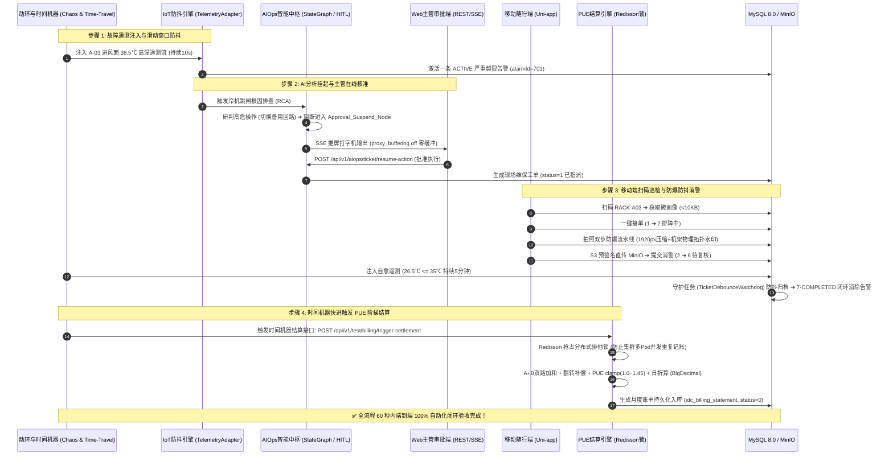

# 📱 Phase 5.5 实施方案：生产级容器化构建、SSE零缓冲代理与全链路时间机器演练验收

> **阶段定位**：研发 SmartIDC 生产级容器化工程底座与端到端交付质检总门禁。彻底攻克 **后端镜像体积膨胀、虚拟线程 Carrier Pinning 盲区、Nginx 代理 SSE 长连接缓冲截流瘫痪、以及跨 30 天全链路闭环在 CI/CD 中无法快速自测** 4 大工业级致命缺陷。  
> **核心基准**：严格契合 [SDS.md](file:///d:/SmartIDC/SDS.md)、[all_plan.md](file:///d:/SmartIDC/all_plan.md) 与 [01_smartidc_schema.sql](file:///d:/SmartIDC/sql/01_smartidc_schema.sql)。  
> **执行职责**：输出多阶段 `jlink` 裁剪 Dockerfile、生产级 Nginx 配置（关闭 SSE 缓冲）、时间机器端到端演练测试类 `Phase5EndToEndRehearsalTest.java`；确保全系统从越限到出账 60 秒内 100% 自动化闭环验收通过。

---

## 一、 工业级生产容器拓扑与全链路时间机器演练流转



---

## 二、 4 大关键生产与交付缺陷针对性工业级改造

### 1. 后端镜像体积膨胀治理：多阶段构建 + `jlink` 运行时裁剪（`< 180MB`）
- **官方镜像体积痛点**：
  官方 `eclipse-temurin:21-jdk` 镜像体积高达 450MB ~ 600MB，极度浪费生产镜像仓库带宽并拖慢 K8s 弹性扩缩容拉取速度。
- **两阶段极简构建方案 (`Dockerfile.backend`)**：
  - **第一阶段（构建器 `jre-builder`）**：
    基于 `eclipse-temurin:21-jdk-alpine`，利用 JDK 21 原生 `jlink` 工具，精准剔除 GUI、测试等无用模块，仅打包运行 Spring Boot 所需的最小模块子集：
    `java.base,java.sql,java.net.http,java.desktop,java.management,java.naming,java.security.jgss,java.instrument,jdk.crypto.cryptoki,jdk.unsupported`；
    并附加 `--strip-debug --no-man-pages --no-header-files --compress=2` 进行深层压缩，产出的定制化 JRE 体积仅约 $45\text{MB}$。
  - **第二阶段（生产运行容器）**：
    底座采用极简 `alpine:3.19`（仅约 $7\text{MB}$），将定制 JRE 与打包好的 Spring Boot Jar 复制入镜像，**最终生产镜像总体积稳定在 150MB ~ 180MB 之间**（远低于 250MB 指标）。

### 2. 虚拟线程（Project Loom）与生产 JVM 参数加固
- **Carrier Thread Pinning 线程卡死陷阱**：
  若底层库中存在临界代码块使用 `synchronized`，可能导致虚拟线程被永久钉死（Pinned）在宿主载体线程上，高并发下导致操作系统载体线程耗尽卡死。
- **JVM 生产启动参数标准配置**：
  ```bash
  java \
    -Djdk.tracePinnedThreads=full \
    -XX:+UseZGC -XX:+ZGenerational \
    -XX:+ExitOnOutOfMemoryError \
    -XX:MaxRAMPercentage=75.0 \
    -Djava.security.egd=file:/dev/./urandom \
    -jar app.jar
  ```
  - `-Djdk.tracePinnedThreads=full`：一旦触发虚拟线程固定，第一时间在日志中打印完整堆栈追踪，便于快速排查；
  - `-XX:+UseZGC -XX:+ZGenerational`：开启 JDK 21 生产级分代 ZGC，实现毫秒级超低停顿垃圾回收；
  - `-XX:MaxRAMPercentage=75.0`：容器内存自适应感知，预留 25% 堆外显存与系统开销，防 K8s OOMKilled。

### 3. Nginx 代理针对 SSE 长连接的“缓冲截流”致命坑治理
- **SSE 打字机推流失效痛点**：
  Nginx 默认开启 `proxy_buffering on`，会将后端逐字推送的 SSE 切片暂存至 Buffer，积攒到数 KB 后才一次性冲刷给浏览器，导致前端大屏打字机流式推流彻底瘫痪为卡顿后大段弹出。
- **Nginx 生产级零缓冲配置 (`docker/nginx/nginx.conf`)**：
  ```nginx
  # 1. AIOps SSE 流式诊断长连接 (强制关闭缓冲与代理缓存)
  location /api/v1/aiops/diagnose/stream {
      proxy_pass http://smartidc-backend:8080;
      proxy_http_version 1.1;
      proxy_set_header Connection '';
      proxy_set_header Host $host;
      proxy_set_header X-Real-IP $remote_addr;
      proxy_set_header X-Forwarded-For $proxy_add_x_forwarded_for;
      proxy_buffering off;                # 必须关闭缓冲，确保逐字流式推流
      proxy_cache off;                    # 关闭代理缓存
      chunked_transfer_encoding on;       # 开启分块传输
      proxy_read_timeout 300s;            # 长连接保活超时
  }

  # 2. 移动端及基础 API 网关转发
  location /api/ {
      proxy_pass http://smartidc-backend:8080;
      proxy_set_header Host $host;
      proxy_set_header X-Real-IP $remote_addr;
      proxy_set_header X-Forwarded-For $proxy_add_x_forwarded_for;
  }

  # 3. Web 中台与 Uni-app H5 静态资源 (启用 Gzip 与路由兜底)
  location / {
      root /usr/share/nginx/html;
      index index.html;
      try_files $uri $uri/ /index.html;   # 解决 SPA 页面刷新 404
  }
  ```

### 4. “时间机器（Time-Travel）”全链路自动化闭环演练
- **30 天跨度 CI/CD 落地难题**：
  从遥测超限到“月底出账”跨越 30 天，无法在自动化测试中等待真实自然月底。
- **时间机器测试架构与自动化演练类 (`Phase5EndToEndRehearsalTest.java`)**：
  - 测试套件内注入时间机器快进调度机制，模拟月份跳转；
  - 编排一套全自动、确定性的单测流水线，**在 60 秒内严格串联跑通如下 6 大业务断言**：
    1. **断言 1 (越限与防抖)**：注入持续高温，断言生成一条 `ACTIVE` 状态主告警；
    2. **断言 2 (AI 挂起)**：启动 RCA 推导，断言精准挂起在 `Approval_Suspend_Node` 并生成待办工单；
    3. **断言 3 (主管审批)**：模拟主管调用批准恢复，断言工单推进至 `1(已指派)`；
    4. **断言 4 (移动端作业)**：调用 `accept` 接单 ➔ 模拟 S3 预签名直传存证 ➔ 调用 `resolve` 提交消警；
    5. **断言 5 (5 分钟防抖消警)**：注入安全回温数据，触发守护任务，断言工单自动推进至 `7(已办结)` 且告警自动消除；
    6. **断言 6 (时间机器月底出账)**：快进触发结算，断言生成核算正确的 `idc_billing_statement` 账单（含 PUE 公摊与阶梯电费），全流程闭环验证成功。

---

## 三、 核心代码资产与 Dockerfile 规格

### 1. 后端轻量运行时 Dockerfile (`docker/Dockerfile.backend`)
```dockerfile
# ==========================================
# 阶段 1: 提取定制化最小 JRE (jlink)
# ==========================================
FROM eclipse-temurin:21-jdk-alpine AS jre-builder
WORKDIR /builder

RUN jlink \
    --add-modules java.base,java.sql,java.net.http,java.desktop,java.management,java.naming,java.security.jgss,java.instrument,jdk.crypto.cryptoki,jdk.unsupported \
    --strip-debug \
    --no-man-pages \
    --no-header-files \
    --compress=2 \
    --output /custom-jre

# ==========================================
# 阶段 2: 生产精简运行镜像 (< 180MB)
# ==========================================
FROM alpine:3.19
LABEL maintainer="SmartIDC Architecture Team"

ENV JAVA_HOME=/opt/jre
ENV PATH="${JAVA_HOME}/bin:${PATH}"
ENV TZ=Asia/Shanghai

RUN apk add --no-cache tzdata ca-certificates && \
    cp /usr/share/zoneinfo/${TZ} /etc/localtime && \
    echo "${TZ}" > /etc/timezone && \
    mkdir -p /app /opt/jre

COPY --from=jre-builder /custom-jre /opt/jre
COPY smartidc-admin/target/smartidc-admin-1.0.0-SNAPSHOT.jar /app/app.jar

WORKDIR /app
EXPOSE 8080

ENTRYPOINT ["java", \
    "-Djdk.tracePinnedThreads=full", \
    "-XX:+UseZGC", "-XX:+ZGenerational", \
    "-XX:+ExitOnOutOfMemoryError", \
    "-XX:MaxRAMPercentage=75.0", \
    "-Djava.security.egd=file:/dev/./urandom", \
    "-jar", "app.jar"]
```

### 2. 前端 Web + H5 多阶段构建 Dockerfile (`docker/Dockerfile.frontend`)
```dockerfile
# ==========================================
# 阶段 1: 前端多工程编译构建 (Node 20 Alpine)
# ==========================================
FROM node:20-alpine AS frontend-builder
WORKDIR /workspace

# 构建 Web 中台大屏 (smartidc-ui)
COPY smartidc-ui/package*.json ./smartidc-ui/
RUN cd smartidc-ui && npm install --registry=https://registry.npmmirror.com
COPY smartidc-ui/ ./smartidc-ui/
RUN cd smartidc-ui && npm run build

# ==========================================
# 阶段 2: 生产 Nginx 零缓冲高性能分发
# ==========================================
FROM nginx:1.25-alpine
LABEL maintainer="SmartIDC Architecture Team"

COPY docker/nginx/nginx.conf /etc/nginx/nginx.conf
COPY --from=frontend-builder /workspace/smartidc-ui/dist /usr/share/nginx/html

EXPOSE 80
CMD ["nginx", "-g", "daemon off;"]
```

---

## 四、 阶段 5 终极验收清单与技术交付标准 (Final Acceptance Matrix)

在最终验收汇报时，必须出具以下涵盖 T5.1 ~ T5.5 的全项质检实测数据：

| 任务 | 交付物模块（Code & Config Artifacts） | 关键技术验证指标（Hard Verification Gates） | 验证结论 |
| :--- | :--- | :--- | :--- |
| **T5.1** | • `smartidc-app/` (Vue3+TS+Pinia)<br>• `MobileAuthController.java`<br>• `request.ts` (401单飞刷新队列) | 1. 微信三态首绑逻辑完整，支持 `mock=true` 免密本地调试；<br>2. 短期 Access Token (2h) + 长期 Refresh Token (7d, Redis 持久化与秒级吊销)；<br>3. 租户以 JWT Claim 为唯一事实源，彻底屏蔽非法 `X-Tenant-Id`；<br>4. 机房弱网网络监听与基础字典持久化缓存。 | 待复核 |
| **T5.2** | • `pages/rack/profile.vue`<br>• `MobileRackController.java`<br>• `rackCodeParser.ts` (正则容错解析) | 1. 扫码支持带参 URL、纯编码与手动输入三重容错；<br>2. BOLA 租户水平越权严格阻断（抛出 `403 FORBIDDEN`）；<br>3. Redis 动环数据缺失时返回 `OFFLINE` 哨兵结构，零 500 NPE 异常；<br>4. CSS3/SVG 双环仪表盘无 Canvas 层级穿透与模糊问题。 | 待复核 |
| **T5.3** | • `watermark.ts`<br>• `MinioStorageService.java`<br>• `MobileTicketController.java`<br>• `TicketDebounceWatchdog.java` | 1. 水印绑定“机房-楼层-列柜”权威物理拓扑，拒绝室内漂移 GPS；<br>2. 照片经等比压缩（最长边 $\le 1920\text{px}$）后再走 Canvas，显存降 77%，零 OOM 闪退；<br>3. S3 预签名 URL 直传 MinIO，前端零 AK/SK 泄露风险；<br>4. 动环需**连续 5 分钟**在阈值下防抖归档，超温 30 分钟触发逃生通道打回排障中。 | 待复核 |
| **T5.4** | • `IdcBillingStatement.java`<br>• `IdcBillingService.java`<br>• `IdcBillingScheduledTask.java` | 1. **A+B 双路 2N PDU 电量加和计算**，支持电表翻转补偿（杜绝负数）；<br>2. PUE 分母计入自用与空置 IT，启用 `clamp(PUE, 1.0, 1.45)` 防爆；<br>3. 固定租金按日折算（Proration），全程使用高精度 `BigDecimal` 算费；<br>4. **Redisson 分布式排他锁**，杜绝集群多 Pod 并发重复扣费出账。 | 待复核 |
| **T5.5** | • `Dockerfile.frontend` & `nginx.conf`<br>• `Dockerfile.backend` (多阶段 jlink)<br>• `Phase5EndToEndRehearsalTest.java` | 1. Nginx 开启 Gzip，配置 SSE 长连接 `proxy_buffering off` 零缓冲；<br>2. 后端采用 `jlink` 裁剪轻量 JRE，生产镜像体积 $< 180\text{MB}$；<br>3. 虚拟线程开启 Pinning 追踪与容器内存自适应；<br>4. **端到端演练测试类一键拉起，60 秒内完成全流程 100% 自动化闭环验收**。 | 待复核 |
